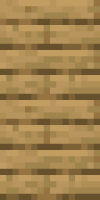
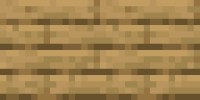

# Software Engineering Project - Klotski 🧩
by Gruppo 2 (Bellinato, Bordin, Caon, Menegale)

   

_**piece3**, **piece1**, **piece2**, **piece0**_ 

---

## Documentazione e istruzioni per l'utilizzo
Tutta la documentazione è consultabile o tramite il sito [klotskigruppo2.it](klotskigruppo2.it) oppure spostandosi sul branch [docs](https://github.com/bellins14/klotski_gruppo2/tree/docs).
Le istruzioni su come installare l'applicazione e giocare sono contenute nel manuale all'inizio del sito (altrimenti sempre sul branch sopra indicato).

## Diritti e licenze
Per il nostro codice sono state utilizzate varie fonti:
* per la NBM, il github di [jeantimex](https://github.com/jeantimex/Klotski)
* per le texture dei blocchi, immagini di [Mojang](https://www.minecraft.net/en-us/terms#commercial)
> Il seguente progetto non è nulla di ufficiale Mojang, non è stato approvato, non è in alcun modo associato alla suddetta
