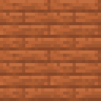
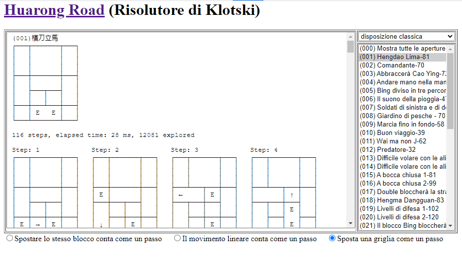

# Software Engineering Project - Klotski 🧩
by Gruppo 2 (Bellinato, Bordin, Caon, Menegale)

   

_**piece3**, **piece1**, **piece2**, **piece0**_ 

---
## Come scrivere file di log
1. modificare come vengono create configurazioni in base al seguente modello:
    - id piece: `piece0` = a, `piece1` = b, `piece2` = c, `piece3` = d;
    - ordine inserimento pezzi: a,a,a,a,b,b,b,b,c,d
2. come identificare coordinate `Piece`:
    - coordinate `piece**n**`(x,y): sempre 3 cifre
    - stampa singolo piece (esempio): `a000300` *corrisponde a* **`piece0`(x=0, y=300)**
3. nel file di `log` inserire in ogni riga lo stato del gioco in quel momento
    - stato = posizione dei vari `Piece` + numero mosse
    - esempio riga (basato su configurazione 4, situazione iniziale):
        - `a000400a100300a200300a300400b000000b000200b300000b300200c100200d100000,0`
        - *=>* **posizioni della config 4**, **numero di mosse = 0**
    - si potrebbe anche fare così (forse più efficiente)
        - `0,a000400a100300a200300a300400b000000b000200b300000b300200c100200d100000`
        - *=>* **numero di mosse = 0**, **posizioni della config 4**

### Riferimento a database online fornito da prof
> Utilizzare queste selezioni:

---
## Istruzioni utilizzo
> da completare