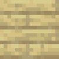

# Software Engineering Project - Klotski 🧩
by Gruppo 2 (Bellinato, Bordin, Caon, Menegale)

   

_**piece3**, **piece1**, **piece2**, **piece0**_ 

## Istruzioni utilizzo
* pobabilmente scaricare javafx e aggiungere libreria in PATH_TO_FX (descivere come in [video JavaFX](https://www.youtube.com/watch?v=9XJicRt_FaI&t=2831s))
