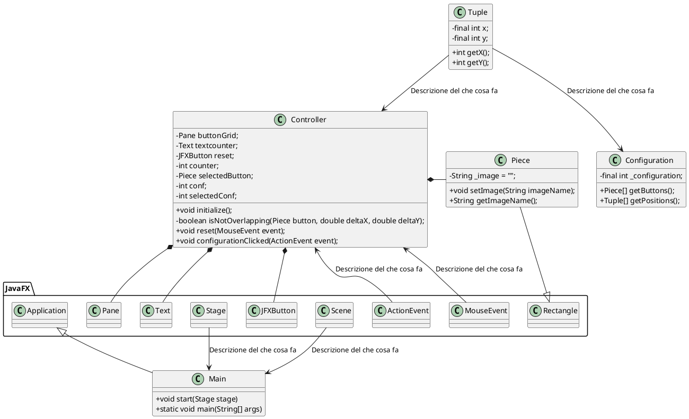
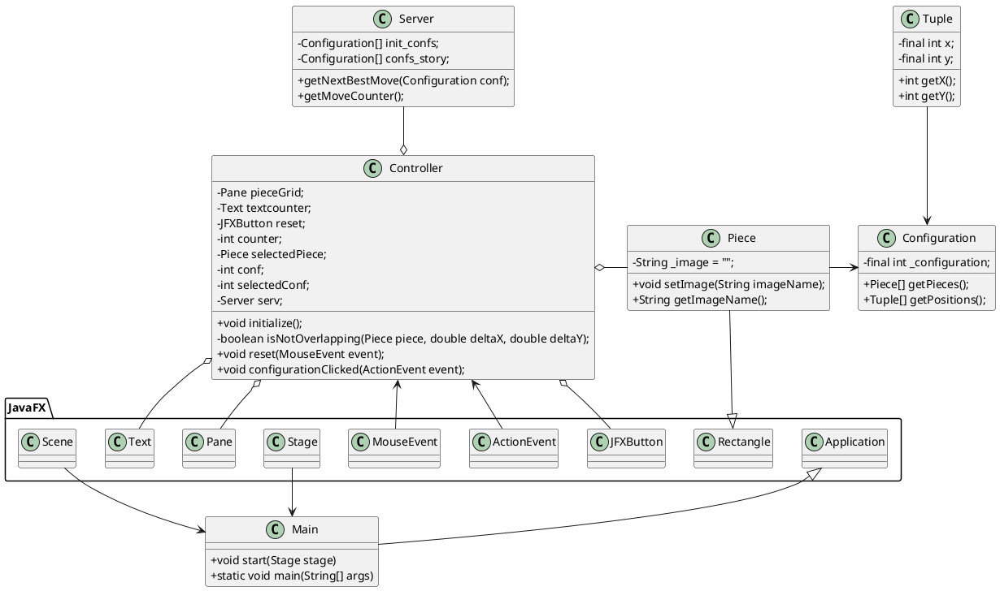

# Class Diagram

```plantuml
@startuml
skinparam classAttributeIconSize 0

Class Configuration{
  - final int _configuration;
  + Piece[] getButtons();
  + Tuple[] getPositions();
}

Class Controller{
  - Pane buttonGrid;
  - Text textcounter;
  - JFXButton reset;
  - int counter;
  - Piece selectedButton;
  - int conf;
  - int selectedConf;
  + void initialize();
  - boolean isNotOverlapping(Piece button, double deltaX, double deltaY); 
  + void reset(MouseEvent event);
  + void configurationClicked(ActionEvent event);
}

Class Piece{
  - String _image = "";
  + void setImage(String imageName);
  + String getImageName();
}

Class Tuple{
  - final int x;
  - final int y;
  + int getX();
  + int getY();
}

Class Main{
  + void start(Stage stage)
  + static void main(String[] args)
}

package JavaFX{

  Class Application{
  }
  
  Class Pane{
  }
  
  Class Text{
  }
  
  Class JFXButton{
  }
  
  Class Rectangle{
  }
  
  Class Stage{
  }
  
  Class MouseEvent{
  }
  
  CLass ActionEvent{
  }
  
  CLass Scene{
  }
}

Main --|> Application
Piece --|> Rectangle
Controller *- Piece
Controller *- Pane
Controller *- Text
Controller *- JFXButton
Tuple --> Controller : Descrizione del che cosa fa
Tuple --> Configuration : Descrizione del che cosa fa
Stage --> Main : Descrizione del che cosa fa
Scene --> Main : Descrizione del che cosa fa
MouseEvent --> Controller : Descrizione del che cosa fa
ActionEvent -up-> Controller : Descrizione del che cosa fa

@enduml
```

# Versione Potenzialmente Successiva
.png)

```plantuml
@startuml
skinparam classAttributeIconSize 0

Class Configuration{
  - final int _configuration;
  + Piece[] getPieces();
  + Tuple[] getPositions();
}

Class Controller{
  - Pane pieceGrid;
  - Text textcounter;
  - JFXButton reset;
  - int counter;
  - Piece selectedPiece;
  - int conf;
  - int selectedConf;
  - Server serv;
  + void initialize();
  - boolean isNotOverlapping(Piece piece, double deltaX, double deltaY); 
  + void reset(MouseEvent event);
  + void configurationClicked(ActionEvent event);
}

Class Piece{
  - String _image = "";
  + void setImage(String imageName);
  + String getImageName();
}

Class Tuple{
  - final int x;
  - final int y;
  + int getX();
  + int getY();
}

Class Server{
  - Configuration[] init_confs;
  - Configuration[] confs_story;
  + getNextBestMove(Configuration conf);
  + getMoveCounter();
}

Class Main{
  + void start(Stage stage)
  + static void main(String[] args)
}

package JavaFX{

  Class Application{
  }
  
  Class Pane{
  }
  
  Class Text{
  }
  
  Class JFXButton{
  }
  
  Class Rectangle{
  }
  
  Class Stage{
  }
  
  Class MouseEvent{
  }
  
  CLass ActionEvent{
  }
  
  CLass Scene{
  }
}

Main --|> Application
Piece --|> Rectangle
Controller o-right- Piece
Controller o-- Pane
Controller o-- Text
Controller o-- JFXButton
Controller o-up- Server
Tuple --> Configuration
Stage --> Main 
Scene --> Main
MouseEvent --> Controller
ActionEvent --> Controller
Piece -> Configuration

@enduml
```
