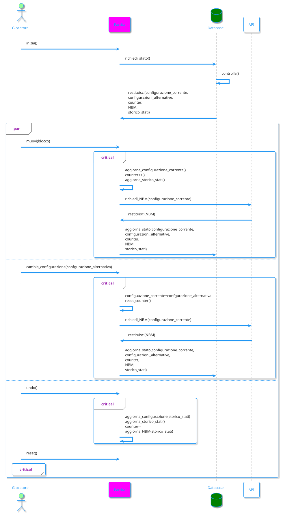

# Sequence Diagram

```plantuml
@startuml
!theme materia-outline

actor Giocatore #99FF99
participant Partita #ff00ff

database Database #008000

Giocatore -> Partita: inizia()

Partita -> Database: richiedi_stato()

Database -> Database: controlla()

Database -> Partita: restituisci(configurazione_corrente,\nconfigurazioni_alternative,\ncounter,\nNBM,\nstorico_stati)

par 
    Giocatore -> Partita: muovi(blocco)
    
    critical 
      Partita -> Partita: aggiorna_configurazione_corrente()\ncounter++()\naggiorna_storico_stati()
      Partita -> API: richiedi_NBM(configurazione_corrente)
      API -> Partita: restituisci(NBM)
      Partita -> Database: aggiorna_stato(configurazione_corrente,\nconfigurazioni_alternative,\ncounter,\nNBM,\nstorico_stati)
    end

else 
    Giocatore -> Partita: cambia_configurazione(confgurazione_alternativa)
    
    critical
      Partita -> Partita: configuazione_corrente=confgurazione_alternativa\nreset_counter()
      Partita -> API: richiedi_NBM(configurazione_corrente)
      API -> Partita: restituisci(NBM)
      Partita -> Database: aggiorna_stato(configurazione_corrente,\nconfigurazioni_alternative,\ncounter,\nNBM,\nstorico_stati)
    end
    
else 
    Giocatore -> Partita: undo()
    
    critical
      Partita -> Partita: aggiorna_configurazione(storico_stati)\naggiorna_storico_stati()\ncounter--\naggiorna_NBM(storico_stati)
    end
else 
    Giocatore -> Partita: reset()
    critical
    end
end

@enduml
```
