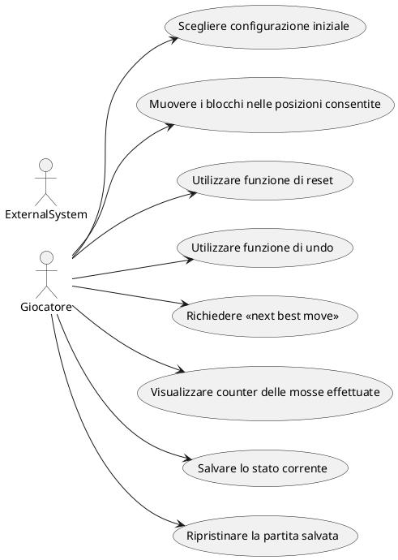

# Use Cases
1. Scegliere configurazione iniziale
2. Muovere i blocchi nelle posizioni consentite
3. Utilizzare funzione di reset
4. Utilizzare funzione di undo
5. Richiedere "next best move"
6. Visualizzare counter delle mosse effettuate
7. Salvare lo stato corrente
8. Ripristinare partita salvata

### Use Case 1
<table>
  <tr>
    <td><b>Nome dello Use Case</b>
    <td>Scegliere configurazione iniziale</td>
  </tr>
  <tr>
    <td><b>Attori</b></td>
    <td>Giocatore</td>
  </tr>
  <tr>
    <td><b>Descrizione</b></td>
    <td>Il giocatore può selezionare una tra quattro configurazioni iniziali da cui partire con il gioco</td>
  </tr>
  <tr>
    <td><b>Precondizioni</b></td>
    <td>Nessuna mossa deve essere stata effettuata, oppure deve essere stato appena indotto un reset della partita</td>
  </tr>
  <tr>
    <td><b>Scenario Principale</b></td>
    <td>Viene impostata dal programma la disposizione iniziale dei blocchi scelta dal giocatore</td>
  </tr>
  <tr>
    <td><b>Scenario Alternativo</b></td>
    <td>La partita può iniziare con la configurazione fornita dal programma</td>
  </tr>
  <tr>
    <td><b>Post-Condizioni</b></td>
    <td>Resettare il counter delle mosse, salvare lo stato corrente, elaborare "next best move"</td>
  </tr>
    <tr>
    <td><b>Note</b></td>
    <td>Valutare se è sempre possibile determinare il "next best move" dalla condizione iniziale</td>
  </tr>
</table>

### Use Case 2
<table>
  <tr>
    <td><b>Nome dello Use Case</b>
    <td>Muovere i blocchi nelle posizioni consentite</td>
  </tr>
  <tr>
    <td><b>Attori</b></td>
    <td>Giocatore</td>
  </tr>
  <tr>
    <td><b>Descrizione</b></td>
    <td>Il giocatore può muovere i blocchi in uno degli spazi liberi sufficientemente grandi</td>
  </tr>
  <tr>
    <td><b>Precondizioni</b></td>
    <td>Deve esistere una posizione consentita, ossia uno spazio libero</td>
  </tr>
  <tr>
    <td><b>Scenario Principale</b></td>
    <td>Il blocco selezionato viene spostato di una posizione nella direzione scelta dal giocatore</td>
  </tr>
  <tr>
    <td><b>Scenario Alternativo</b></td>
    <td>Il blocco selezionato non si muove</td>
  </tr>
  <tr>
    <td><b>Post-Condizioni</b></td>
    <td>Incrementare il counter delle mosse, salvare lo stato corrente, elaborare "next best move"</td>
  </tr>
    <tr>
    <td><b>Note</b></td>
    <td>-</td>
  </tr>
</table>

### Use Case 3
<table>
  <tr>
    <td><b>Nome dello Use Case</b>
    <td>Utilizzare funzione di reset</td>
  </tr>
  <tr>
    <td><b>Attori</b></td>
    <td>Giocatore</td>
  </tr>
  <tr>
    <td><b>Descrizione</b></td>
    <td>Il giocatore può resettare la partita attraverso un tasto dedicato. </td>
  </tr>
  <tr>
    <td><b>Precondizioni</b></td>
    <td>-</td>
  </tr>
  <tr>
    <td><b>Scenario Principale</b></td>
    <td>In qualsiasi momento l giocatore può decidere di resettare la partita premendo il tasto "reset". I blocchi devono essere sistemati nella configurazione iniziale</td>
  </tr>
  <tr>
    <td><b>Scenario Alternativo</b></td>
    <td>Se il giocatore non ha ancora effettuato alcuna mossa, il reset non fa nulla </td>
  </tr>
  <tr>
    <td><b>Post-Condizioni</b></td>
    <td>Resettare il counter delle mosse, salvare lo stato corrente, elaborare "next best move"</td>
  </tr>
    <tr>
    <td><b>Note</b></td>
    <td>-</td>
  </tr>
</table>

### Use Case 4
<table>
  <tr>
    <td><b>Nome dello Use Case</b>
    <td>Utilizzare funzione di undo</td>
  </tr>
  <tr>
    <td><b>Attori</b></td>
    <td>Giocatore</td>
  </tr>
  <tr>
    <td><b>Descrizione</b></td>
    <td>Il giocatore può scegliere di annullare una o più mosse, in ordine cronologico dalla più recente alla meno recente, fino alla situazione di partenza</td>
  </tr>
  <tr>
    <td><b>Precondizioni</b></td>
    <td>Deve essere stata eseguita almeno una mossa</td>
  </tr>
  <tr>
    <td><b>Scenario Principale</b></td>
    <td>La disposizione dei blocchi ritorna allo stato precedente alla mossa eseguita che si vuole annullare</td>
  </tr>
  <tr>
    <td><b>Scenario Alternativo</b></td>
    <td>Non viene applicata alcuna modifica allo stato di gioco</td>
  </tr>
  <tr>
    <td><b>Post-Condizioni</b></td>
    <td>Decrementare il counter delle mosse, salvare lo stato corrente, elaborare "next best move"</td>
  </tr>
    <tr>
    <td><b>Note</b></td>
    <td>-</td>
  </tr>
</table>

### Use Case 5
<table>
  <tr>
    <td><b>Nome dello Use Case</b>
    <td>Next Best Move</td>
  </tr>
  <tr>
    <td><b>Attori</b></td>
    <td>Giocatore(?)</td>
  </tr>
  <tr>
    <td><b>Descrizione</b></td>
    <td>Viene fornita la mossa migliore per quella configurazione</td>
  </tr>
  <tr>
    <td><b>Precondizioni</b></td>
    <td>La partita non deve essere finita</td>
  </tr>
  <tr>
    <td><b>Scenario Principale</b></td>
    <td>ogni volta che si clicca su questo bottone un blocco alla volta verrà spostato in modo da ottenere la vittoria nel minor numero di mosse necessarie.</td>
  </tr>
  <tr>
    <td><b>Scenario Alternativo</b></td>
    <td>Viene visualizzato il messaggio "Mossa non disponibile"</td>
  </tr>
  <tr>
    <td><b>Post-Condizioni</b></td>
    <td>Incrementare il counter delle mosse, salvare lo stato corrente, calcolare la next best move</td>
  </tr>
    <tr>
    <td><b>Note</b></td>
    <td>-</td>
  </tr>
</table>

### Use Case 6
<table>
  <tr>
    <td><b>Nome dello Use Case</b>
    <td>Visualizzare counter delle mosse effettuate</td>
  </tr>
  <tr>
    <td><b>Attori</b></td>
    <td>Giocatore</td>
  </tr>
  <tr>
    <td><b>Descrizione</b></td>
    <td>Il giocatore deve ruscire a visualizzare il counter delle mosse</td>
  </tr>
  <tr>
    <td><b>Precondizioni</b></td>
    <td>Deve essere disposto un counter nell'interfaccia grafica che mostra il numero di mosse svolte fino a quel
        momento
    </td>
  </tr>
  <tr>
    <td><b>Scenario Principale</b></td>
    <td>Ogni volta che il giocatore fa una mossa, il counter viene aumentato</td>
  </tr>
  <tr>
    <td><b>Scenario Alternativo</b></td>
    <td>-</td>
  </tr>
  <tr>
    <td><b>Post-Condizioni</b></td>
    <td>-</td>
  </tr>
    <tr>
    <td><b>Note</b></td>
    <td>-</td>
  </tr>
</table>

### Use Case 7
<table>
  <tr>
    <td><b>Nome dello Use Case</b>
    <td>Salvare lo stato corrente</td>
  </tr>
  <tr>
    <td><b>Attori</b></td>
    <td>Gioco</td>
  </tr>
  <tr>
    <td><b>Descrizione</b></td>
    <td>Il gioco deve sempre salvare lo stato corrente </td>
  </tr>
  <tr>
    <td><b>Precondizioni</b></td>
    <td>-</td>
  </tr>
  <tr>
    <td><b>Scenario Principale</b></td>
    <td>Ogni volta che il giocatore effettua un'azione che impatta sulla disposizione dei blocchi (mossa, undo, reset o scelta della configurazione iniziale), il gioco deve salvare automaticamente lo stato della partita, in modo che, se il programma dovesse essere chiuso, all'avvio successivo lo stato della partita possa essere ripristinato</td>
  </tr>
  <tr>
    <td><b>Scenario Alternativo</b></td>
    <td>Se il giocatore non ha ancora effettuato alcuna mossa, il reset non fa nulla </td>
  </tr>
  <tr>
    <td><b>Post-Condizioni</b></td>
    <td>-</td>
  </tr>
    <tr>
    <td><b>Note</b></td>
    <td>Lo stato corrente deve comprendere la configurazione dei blocchi, le configurazioni iniziali, il counter delle mosse, lo storico delle mosse</td>
  </tr>
</table>

### Use Case 8
<table>
  <tr>
    <td><b>Nome dello Use Case</b>
    <td>Ripristinare partita salvata</td>
  </tr>
  <tr>
    <td><b>Attori</b></td>
    <td>Gioco</td>
  </tr>
  <tr>
    <td><b>Descrizione</b></td>
    <td>Quando il giocatore riapre l'applicazione, il gioco carica l'ultimo stato salvato</td>
  </tr>
  <tr>
    <td><b>Precondizioni</b></td>
    <td>Deve essere presente un salvataggio di gioco, la partita caricata non deve essere già conclusa</td>
  </tr>
  <tr>
    <td><b>Scenario Principale</b></td>
    <td>La disposizione dei blocchi ritorna allo stato precedente alla mossa eseguita che si vuole annullare</td>
  </tr>
  <tr>
    <td><b>Scenario Alternativo</b></td>
    <td>Non viene applicata alcuna modifica allo stato di gioco</td>
  </tr>
  <tr>
    <td><b>Post-Condizioni</b></td>
    <td>Decrementare il counter delle mosse, salvare lo stato corrente, elaborare "next best move"</td>
  </tr>
    <tr>
    <td><b>Note</b></td>
    <td>-</td>
  </tr>
</table>

# Grafo Use Cases

