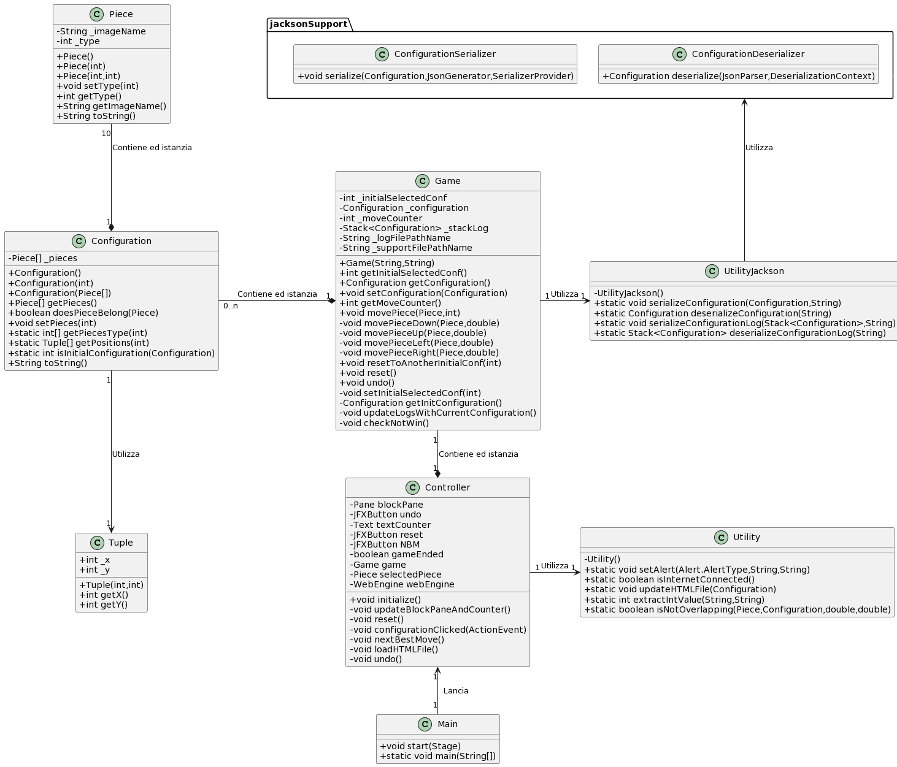
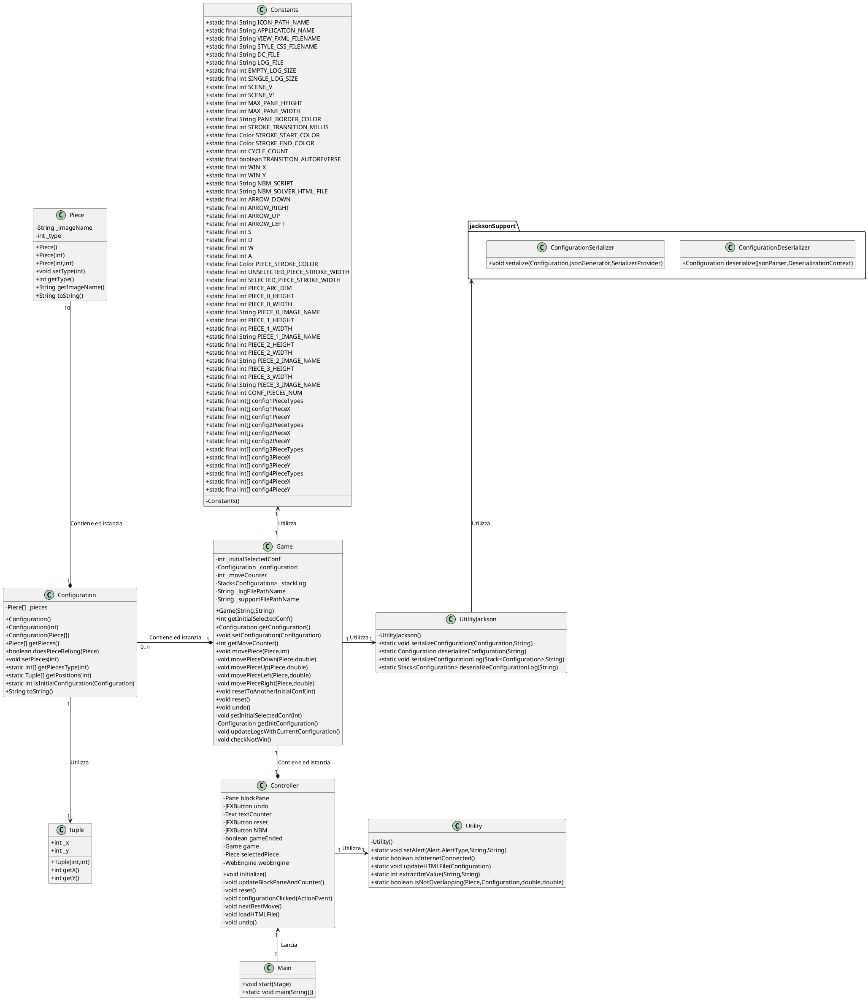
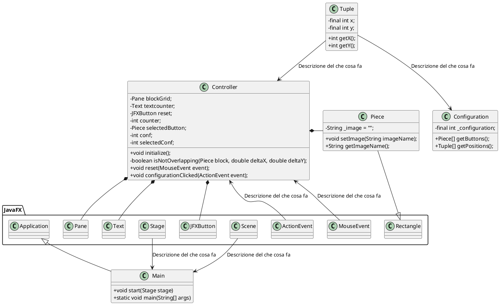
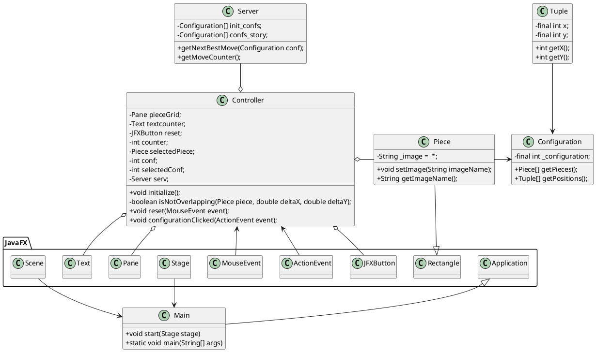

# Class Diagram

```plantuml
@startuml
skinparam classAttributeIconSize 0

class Constants {
  + static final String ICON_PATH_NAME
  + static final String APPLICATION_NAME
  + static final String VIEW_FXML_FILENAME
  + static final String STYLE_CSS_FILENAME
  + static final String DC_FILE
  + static final String LOG_FILE
  + static final int EMPTY_LOG_SIZE
  + static final int SINGLE_LOG_SIZE
  + static final int SCENE_V
  + static final int SCENE_V1
  + static final int MAX_PANE_HEIGHT
  + static final int MAX_PANE_WIDTH
  + static final String PANE_BORDER_COLOR
  + static final int STROKE_TRANSITION_MILLIS
  + static final Color STROKE_START_COLOR
  + static final Color STROKE_END_COLOR
  + static final int CYCLE_COUNT
  + static final boolean TRANSITION_AUTOREVERSE
  + static final int WIN_X
  + static final int WIN_Y
  + static final String NBM_SCRIPT
  + static final String NBM_SOLVER_HTML_FILE
  + static final int ARROW_DOWN
  + static final int ARROW_RIGHT
  + static final int ARROW_UP
  + static final int ARROW_LEFT
  + static final int S
  + static final int D
  + static final int W
  + static final int A
  + static final Color PIECE_STROKE_COLOR
  + static final int UNSELECTED_PIECE_STROKE_WIDTH
  + static final int SELECTED_PIECE_STROKE_WIDTH
  + static final int PIECE_ARC_DIM
  + static final int PIECE_0_HEIGHT
  + static final int PIECE_0_WIDTH
  + static final String PIECE_0_IMAGE_NAME
  + static final int PIECE_1_HEIGHT
  + static final int PIECE_1_WIDTH
  + static final String PIECE_1_IMAGE_NAME
  + static final int PIECE_2_HEIGHT
  + static final int PIECE_2_WIDTH
  + static final String PIECE_2_IMAGE_NAME
  + static final int PIECE_3_HEIGHT
  + static final int PIECE_3_WIDTH
  + static final String PIECE_3_IMAGE_NAME
  + static final int CONF_PIECES_NUM
  + static final int[] config1PieceTypes
  + static final int[] config1PieceX
  + static final int[] config1PieceY
  + static final int[] config2PieceTypes
  + static final int[] config2PieceX
  + static final int[] config2PieceY
  + static final int[] config3PieceTypes
  + static final int[] config3PieceX
  + static final int[] config3PieceY
  + static final int[] config4PieceTypes
  + static final int[] config4PieceX
  + static final int[] config4PieceY
  - Constants()
}


class Main {
  + void start(Stage)
  + static void main(String[])
}


class Piece {
  - String _imageName
  - int _type
  + Piece()
  + Piece(int)
  + Piece(int,int)
  + void setType(int)
  + int getType()
  + String getImageName()
  + String toString()
}


class Utility {
  - Utility()
  + static void setAlert(Alert.AlertType,String,String)
  + static boolean isInternetConnected()
  + static void updateHTMLFile(Configuration)
  + static int extractIntValue(String,String)
  + static boolean isNotOverlapping(Piece,Configuration,double,double)
}


class Game {
  - int _initialSelectedConf
  - Configuration _configuration
  - int _moveCounter
  - Stack<Configuration> _stackLog
  - String _logFilePathName
  - String _supportFilePathName
  + Game(String,String)
  + int getInitialSelectedConf()
  + Configuration getConfiguration()
  + void setConfiguration(Configuration)
  + int getMoveCounter()
  + void movePiece(Piece,int)
  - void movePieceDown(Piece,double)
  - void movePieceUp(Piece,double)
  - void movePieceLeft(Piece,double)
  - void movePieceRight(Piece,double)
  + void resetToAnotherInitialConf(int)
  + void reset()
  + void undo()
  - void setInitialSelectedConf(int)
  - Configuration getInitConfiguration()
  - void updateLogsWithCurrentConfiguration()
  - void checkNotWin()
}


class Controller {
  - Pane blockPane
  - JFXButton undo
  - Text textCounter
  - JFXButton reset
  - JFXButton NBM
  - boolean gameEnded
  - Game game
  - Piece selectedPiece
  - WebEngine webEngine
  + void initialize()
  - void updateBlockPaneAndCounter()
  - void reset()
  - void configurationClicked(ActionEvent)
  - void nextBestMove()
  - void loadHTMLFile()
  - void undo()
}


package jacksonSupport{
  class ConfigurationDeserializer {
    + Configuration deserialize(JsonParser,DeserializationContext)
  }
  class ConfigurationSerializer {
    + void serialize(Configuration,JsonGenerator,SerializerProvider)
  }
}


class Configuration {
  - Piece[] _pieces
  + Configuration()
  + Configuration(int)
  + Configuration(Piece[])
  + Piece[] getPieces()
  + boolean doesPieceBelong(Piece)
  + void setPieces(int)
  + static int[] getPiecesType(int)
  + static Tuple[] getPositions(int)
  + static int isInitialConfiguration(Configuration)
  + String toString()
}


class UtilityJackson {
  - UtilityJackson()
  + static void serializeConfiguration(Configuration,String)
  + static Configuration deserializeConfiguration(String)
  + static void serializeConfigurationLog(Stack<Configuration>,String)
  + static Stack<Configuration> deserializeConfigurationLog(String)
}


class Tuple {
  + int _x
  + int _y
  + Tuple(int,int)
  + int getX()
  + int getY()
}


Configuration "1" -down-> "1" Tuple : Utilizza

Piece "10" -down-* "1" Configuration : Contiene ed istanzia

Configuration "0..n" -right-* "1" Game : "   Contiene ed istanzia   "

Game "1" -down-* "1" Controller :  Contiene ed istanzia

Game "1" -up-> "1" Constants : Utilizza

Game "1" -right-> "1" UtilityJackson : Utilizza

Main "1" -up-> "1" Controller : "  Lancia  "

UtilityJackson -up-> jacksonSupport : Utilizza

Controller "1" -right-> "1" Utility : Utilizza

@enduml
```

## Deprecato

.png)

```plantuml
@startuml
skinparam classAttributeIconSize 0

Class Configuration{
  - final int _configuration;
  + Piece[] getButtons();
  + Tuple[] getPositions();
}

Class Controller{
  - Pane blockGrid;
  - Text textcounter;
  - JFXButton reset;
  - int counter;
  - Piece selectedButton;
  - int conf;
  - int selectedConf;
  + void initialize();
  - boolean isNotOverlapping(Piece block, double deltaX, double deltaY); 
  + void reset(MouseEvent event);
  + void configurationClicked(ActionEvent event);
}

Class Piece{
  - String _image = "";
  + void setImage(String imageName);
  + String getImageName();
}

Class Tuple{
  - final int x;
  - final int y;
  + int getX();
  + int getY();
}

Class Main{
  + void start(Stage stage)
  + static void main(String[] args)
}

package JavaFX{

  Class Application{
  }
  
  Class Pane{
  }
  
  Class Text{
  }
  
  Class JFXButton{
  }
  
  Class Rectangle{
  }
  
  Class Stage{
  }
  
  Class MouseEvent{
  }
  
  CLass ActionEvent{
  }
  
  CLass Scene{
  }
}

Main --|> Application
Piece --|> Rectangle
Controller *- Piece
Controller *- Pane
Controller *- Text
Controller *- JFXButton
Tuple --> Controller : Descrizione del che cosa fa
Tuple --> Configuration : Descrizione del che cosa fa
Stage --> Main : Descrizione del che cosa fa
Scene --> Main : Descrizione del che cosa fa
MouseEvent --> Controller : Descrizione del che cosa fa
ActionEvent -up-> Controller : Descrizione del che cosa fa

@enduml
```

# Versione Potenzialmente Successiva
.png)

```plantuml
@startuml
skinparam classAttributeIconSize 0

Class Configuration{
  - final int _configuration;
  + Piece[] getPieces();
  + Tuple[] getPositions();
}

Class Controller{
  - Pane pieceGrid;
  - Text textcounter;
  - JFXButton reset;
  - int counter;
  - Piece selectedPiece;
  - int conf;
  - int selectedConf;
  - Server serv;
  + void initialize();
  - boolean isNotOverlapping(Piece piece, double deltaX, double deltaY); 
  + void reset(MouseEvent event);
  + void configurationClicked(ActionEvent event);
}

Class Piece{
  - String _image = "";
  + void setImage(String imageName);
  + String getImageName();
}

Class Tuple{
  - final int x;
  - final int y;
  + int getX();
  + int getY();
}

Class Server{
  - Configuration[] init_confs;
  - Configuration[] confs_story;
  + getNextBestMove(Configuration conf);
  + getMoveCounter();
}

Class Main{
  + void start(Stage stage)
  + static void main(String[] args)
}

package JavaFX{

  Class Application{
  }
  
  Class Pane{
  }
  
  Class Text{
  }
  
  Class JFXButton{
  }
  
  Class Rectangle{
  }
  
  Class Stage{
  }
  
  Class MouseEvent{
  }
  
  CLass ActionEvent{
  }
  
  CLass Scene{
  }
}

Main --|> Application
Piece --|> Rectangle
Controller o-right- Piece
Controller o-- Pane
Controller o-- Text
Controller o-- JFXButton
Controller o-up- Server
Tuple --> Configuration
Stage --> Main 
Scene --> Main
MouseEvent --> Controller
ActionEvent --> Controller
Piece -> Configuration

@enduml
```
