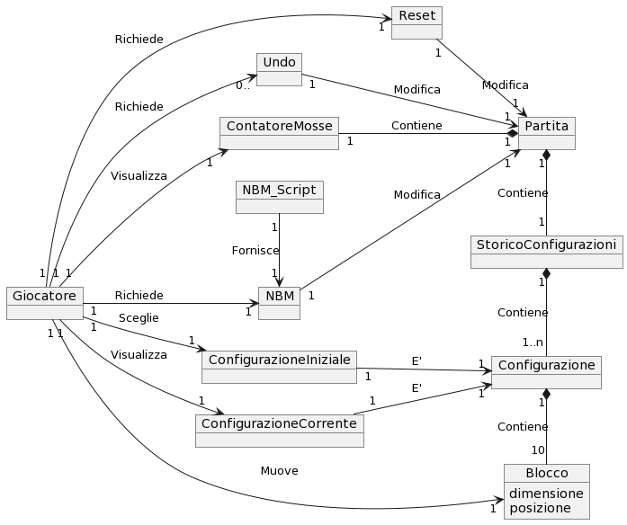
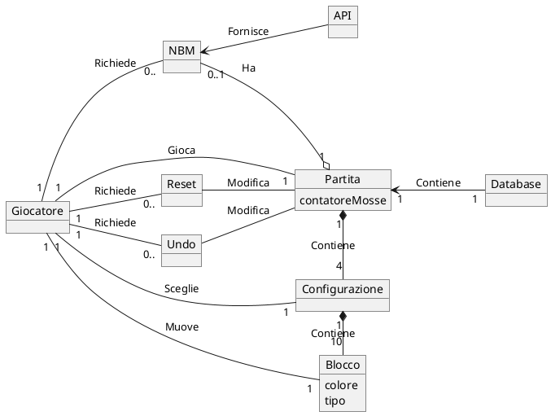
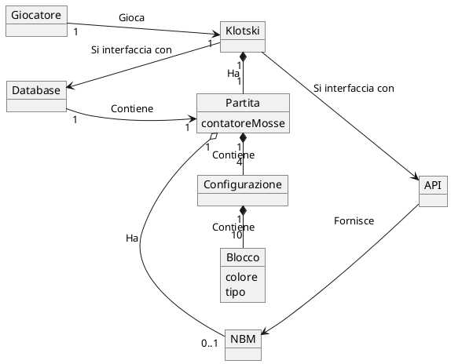

# Grafi Domain Model

* Il giocatore inizia la partita.
* Il giocatore sceglie tra 4 configurazioni.
* Le configurazioni sono formate da 10 blocchi ciascuna.
* Il giocatore muove un blocco e si aggiorna il counter delle mosse.
* Il giocatore può tornare indietro tramite una funzione undo.
* Il giocatore può decidere di farsi consigliare la nbm da un sistema esterno.
* Il giocatore può resettare la partita.
* Il giocatore può uscire dalla partita.
* La partita viene salvata all interno del DB.
* Il giocatore deve ricominciare da dove aveva lasciato una volta riaperto il gioco.
* Il giocatore deve sapere quando ha vinto
* Il giovatore deve cominciare una altra partita dopo che ha concluso quella precedente.
* Il DB viene resettato.

## Corrente
Grafo senza la classe concettuale Klotski

## Deprecato(?)
Grafico con la classe concettuale "Klotski"

