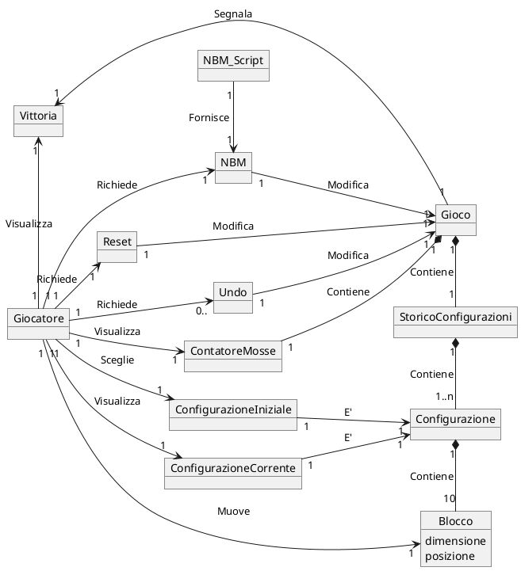

# Domain Model

```plantuml
@startuml

left to right direction
object Giocatore
object Configurazione

object Blocco{
  dimensione
  posizione
}

object Gioco
object StoricoConfigurazioni
object NBM_Script
object NBM
object Reset
object Undo
object ConfigurazioneIniziale
object ConfigurazioneCorrente
object ContatoreMosse
object Vittoria

Giocatore "1" --> "1" ConfigurazioneIniziale : Sceglie

ConfigurazioneIniziale "1" --> "1" Configurazione : E'

Giocatore "1" --> "1" ConfigurazioneCorrente : Visualizza

ConfigurazioneCorrente "1" --> "1" Configurazione : E'

Giocatore "1" --> "1" Blocco : Muove

Configurazione "1" *-right- "10" Blocco : \nContiene\n

StoricoConfigurazioni "1" *-right- "1..n" Configurazione : \nContiene\n

StoricoConfigurazioni "1" -left-* "1" Gioco : \nContiene\n

NBM_Script "1" -right-> "1" NBM : \nFornisce\n

Giocatore "1" -right-> "1" Reset : Richiede

Giocatore "1" -left-> "1" Vittoria : Visualizza

Gioco "1" --> "1" Vittoria : Segnala

Giocatore "1" --> "0.." Undo : Richiede

Giocatore "1" --> "1" NBM : Richiede

NBM "1" -right-> "1" Gioco : Modifica

Giocatore "1" --> "1" ContatoreMosse : Visualizza

ContatoreMosse "1" -down-* "1" Gioco : Contiene

Reset "1" -right-> "1" Gioco : Modifica

Undo "1" --> "1" Gioco : Modifica

@enduml
```
