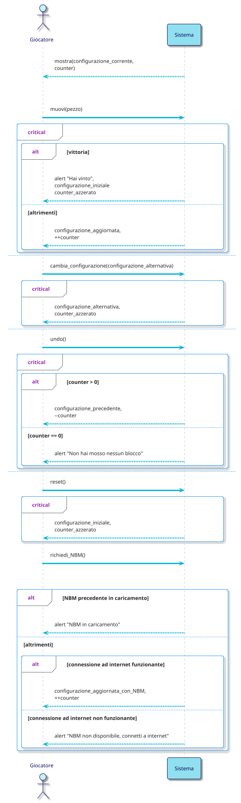
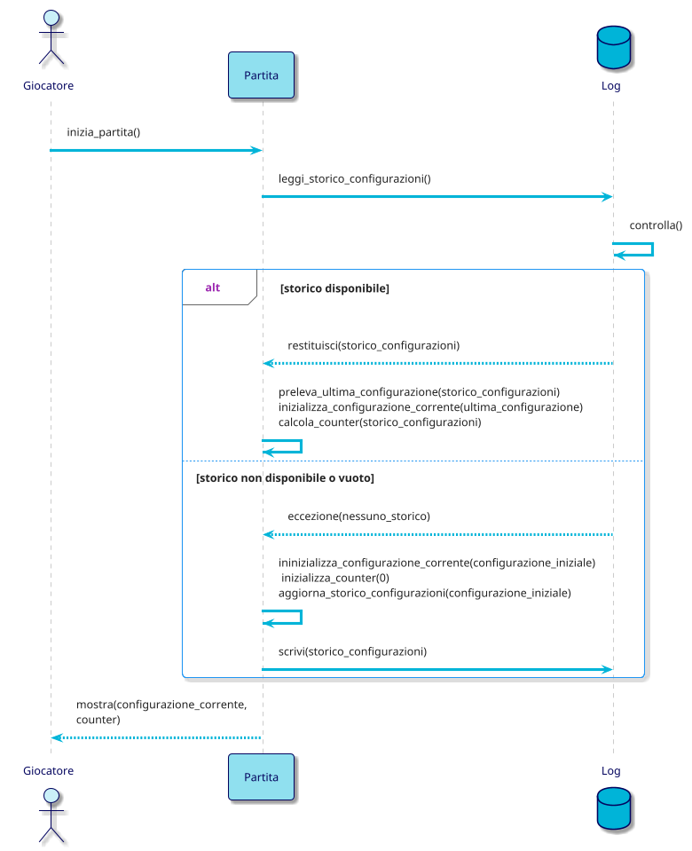
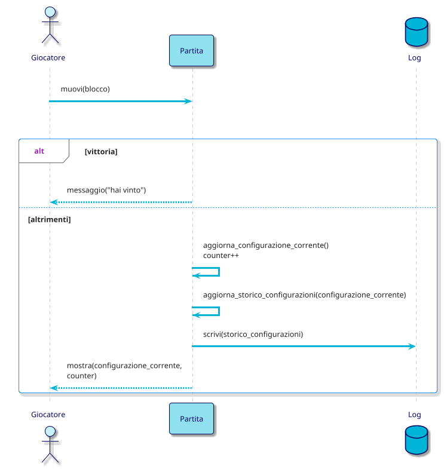
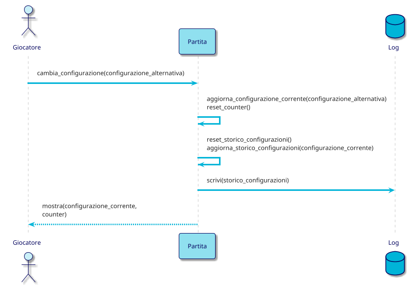
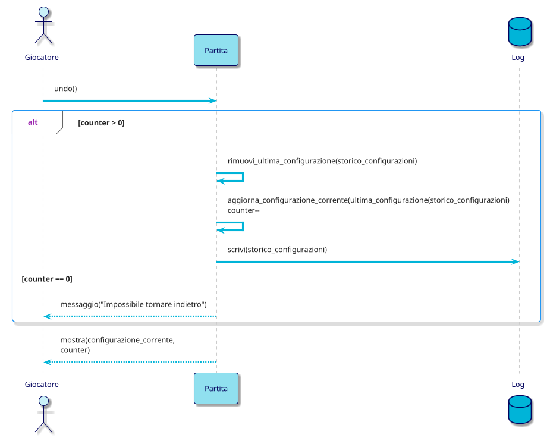
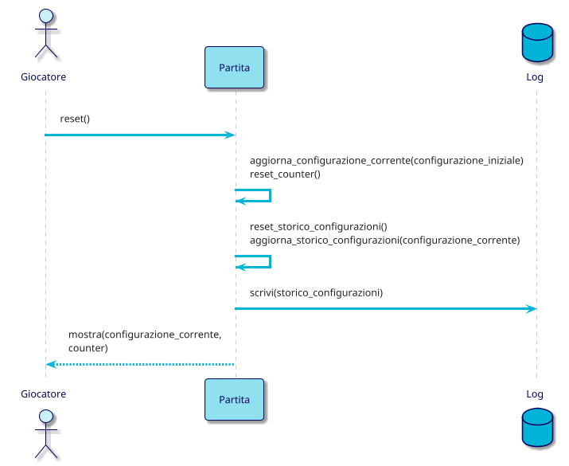
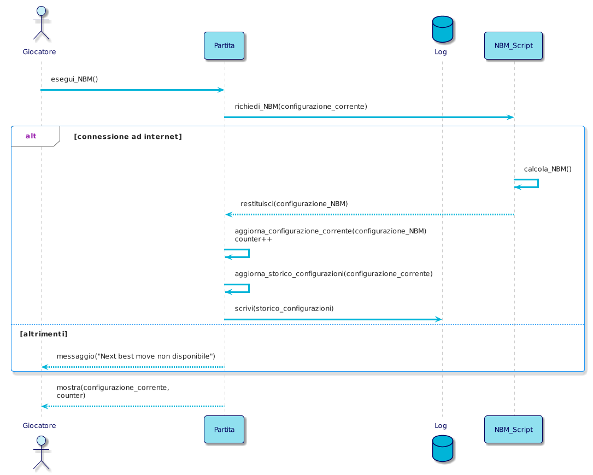
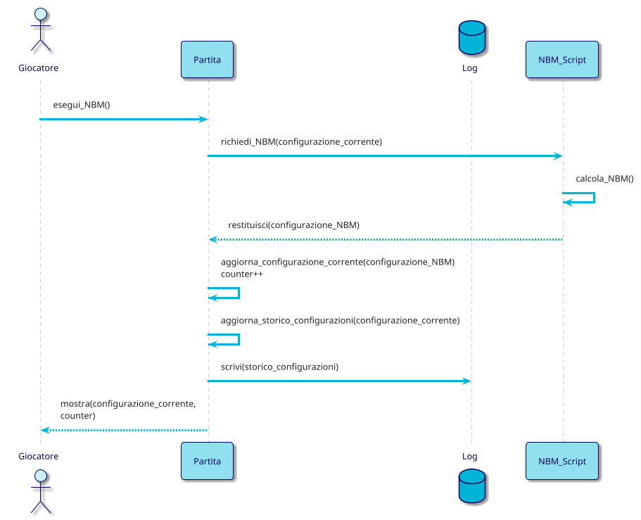

# System Sequence Diagram

# Internal Sequence Diagrams

## inizia_partita()

## muovi(blocco)

## cambia_configurazione(configurazione_alternativa)

## undo()

## reset()

## richiedi_NBM()

## Internal Sequence Diagram - Completo(da Eliminare)

```plantuml
@startuml
!theme materia-outline

actor Giocatore 
participant Partita #ff00ff
database Database #99FF99
participant API #ff0000
skinparam BackgroundColor #FFFFFF


Giocatore -> Partita: inizia_partita()

Partita -> Database: richiedi_storico_stati()
Database -> Database: controlla()


alt storico disponibile
    Database --> Partita: restituisci(storico_stati)

else storico non disponibile
    Database --> Partita: eccezione(nessuno_storico)
    Partita -> Database: richiedi_configurazioni()
    Database --> Partita: restituisci(configurazioni)
    Partita -> Partita: scegli_configurazione_iniziale(configurazioni)

end

Partita -> API: richiedi_NBM(configurazione_corrente)
API --> Partita: restituisci(NBM)

Partita --> Giocatore: mostra(configurazione_corrente,\ncounter)

par 
    Giocatore -> Partita: muovi(blocco)
    
    critical 
    alt vittoria
      Partita --> Giocatore:messaggio("hai vinto")

      else altrimenti
      Partita -> Partita: aggiorna_configurazione_corrente()\ncounter++
      Partita -> Partita: aggiorna_storico_stati(nuovo_stato)
      Partita -> Database: upload(storico_stati)
    
      Partita -> API: richiedi_NBM(configurazione_corrente)
      API --> Partita: restituisci(NBM)
      Partita --> Giocatore: mostra(configurazione_corrente,\ncounter)

    end

    end

else 
    Giocatore -> Partita: cambia_configurazione(configurazione_alternativa)
    
    critical
      Partita -> Partita: aggiorna_configuazione_corrente(configurazione_alternativa)\nreset_counter()\nreset_storico_stati()
      Partita -> Partita: aggiorna_storico_stati(nuovo_stato)
      Partita -> Database: upload(storico_stati)
      
      Partita -> API: richiedi_NBM(configurazione_corrente)
      API --> Partita: restituisci(NBM)
      
      Partita-->Giocatore: mostra(configurazione_corrente,\ncounter)
    end
    
else 
    Giocatore -> Partita: undo()

    critical
      Partita -> Partita: aggiorna_configurazione_corrente(stato_precedente[configurazione_corrente])\ncounter--
      Partita -> Partita: rimuovi_ultimo_stato(storico_stati)
      Partita -> Database: upload(storico_stati)
      
      Partita -> API: richiedi_NBM(configurazione_corrente)
      API --> Partita: restituisci(NBM)
      
      Partita --> Giocatore: mostra(configurazione_corrente,\ncounter)

    end
    
else 
    Giocatore -> Partita: reset()
    critical
      Partita -> Partita: aggiorna_configurazione_corrente(configurazione_iniziale)\nreset_counter()
      Partita -> Partita: reset_storico_stati()
      Partita -> Database: upload(storico_stati)
      
      Partita -> API: richiedi_NBM(configurazione_corrente)
      API --> Partita: restituisci(NBM)    
      
      Partita --> Giocatore: mostra(configurazione_corrente,\ncounter)

    end
    
Giocatore -> Partita: esegui_NBM()
    
    critical 
      Partita -> Partita: aggiorna_configurazione_corrente()\ncounter++
      Partita -> Partita: aggiorna_storico_stati(nuovo_stato)
      Partita -> Database: upload(storico_stati)
    
      Partita -> API: richiedi_NBM(configurazione_corrente)
      API --> Partita: restituisci(NBM)
      Partita --> Giocatore: mostra(configurazione_corrente,\ncounter)


    end
end
@enduml
```

