# System Sequence Diagram

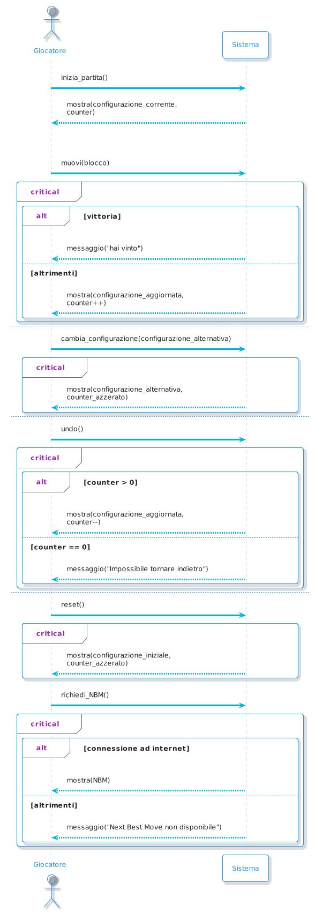

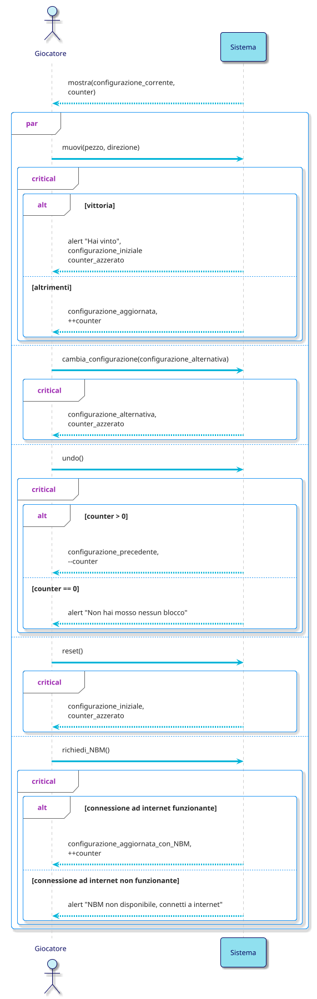

# Internal Sequence Diagrams

## muovi(pezzo, keyCode)

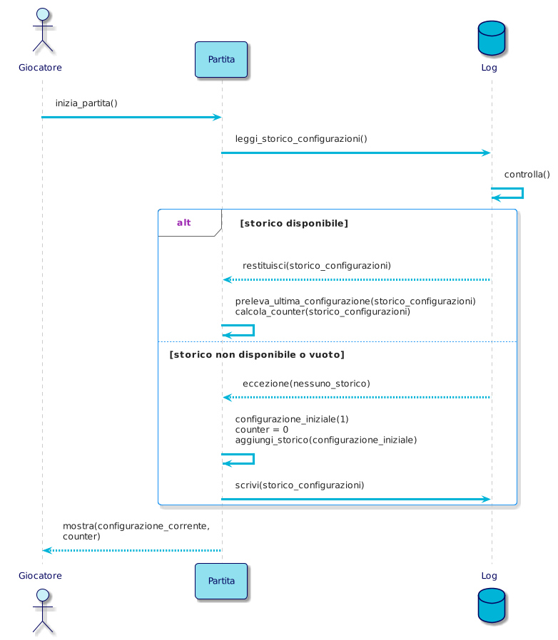

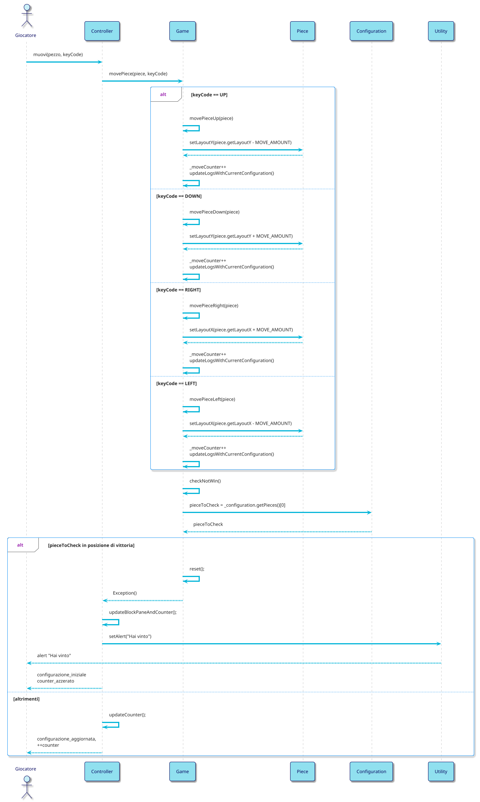

## cambia_configurazione(configurazione_alternativa)

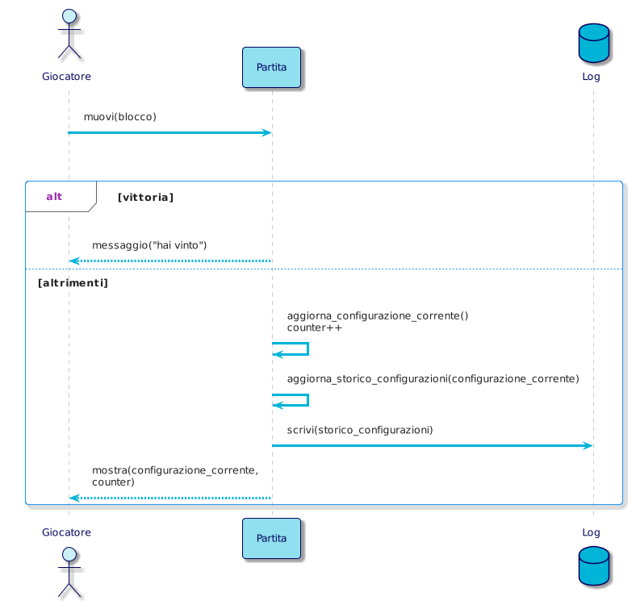

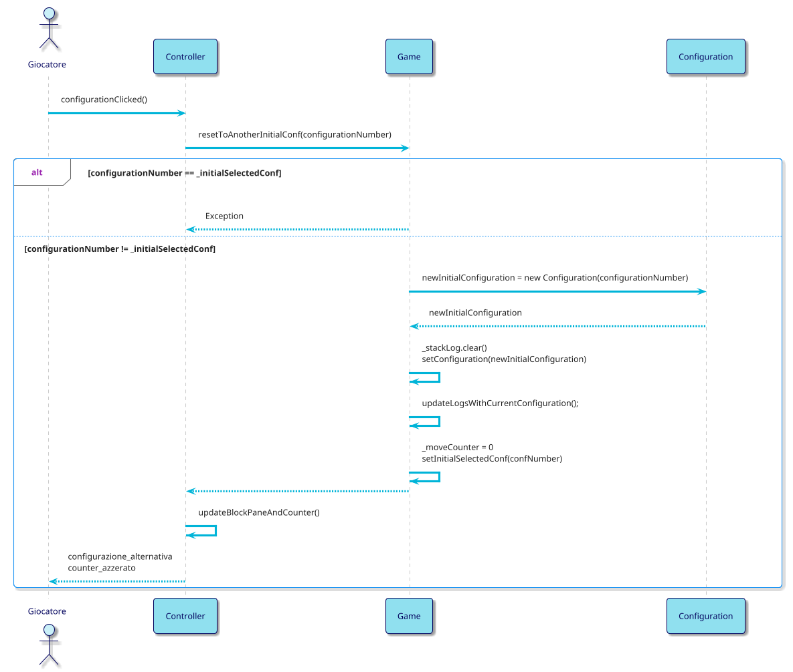

## undo()

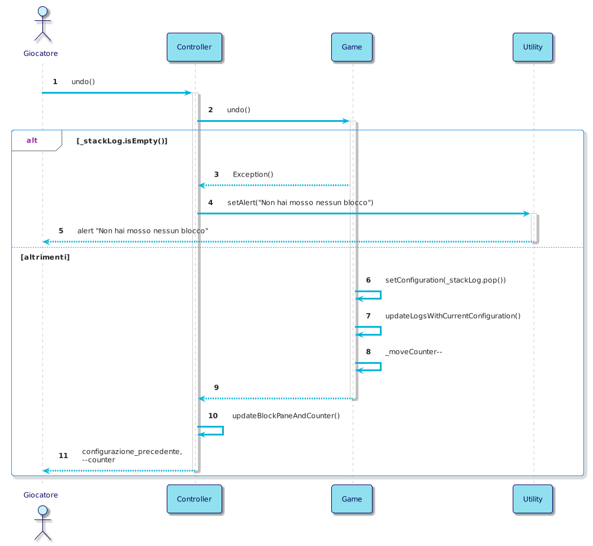

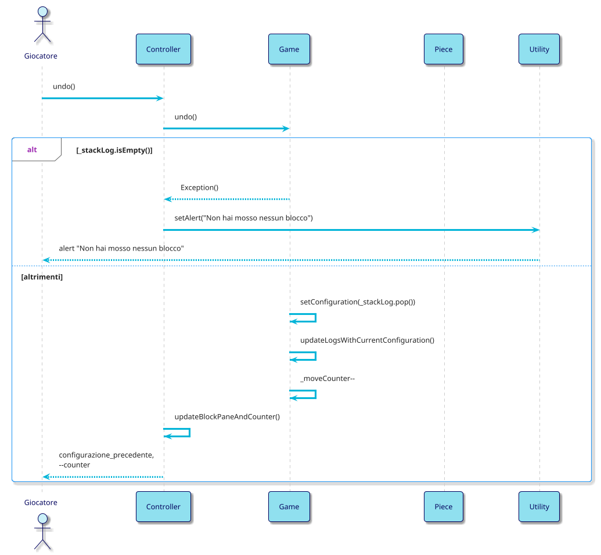

## reset()

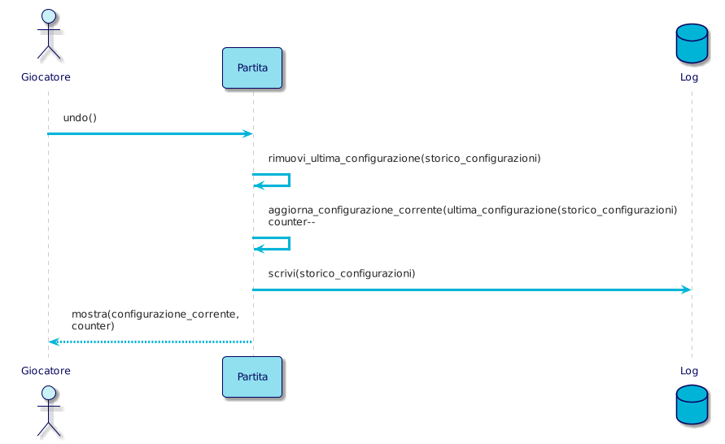

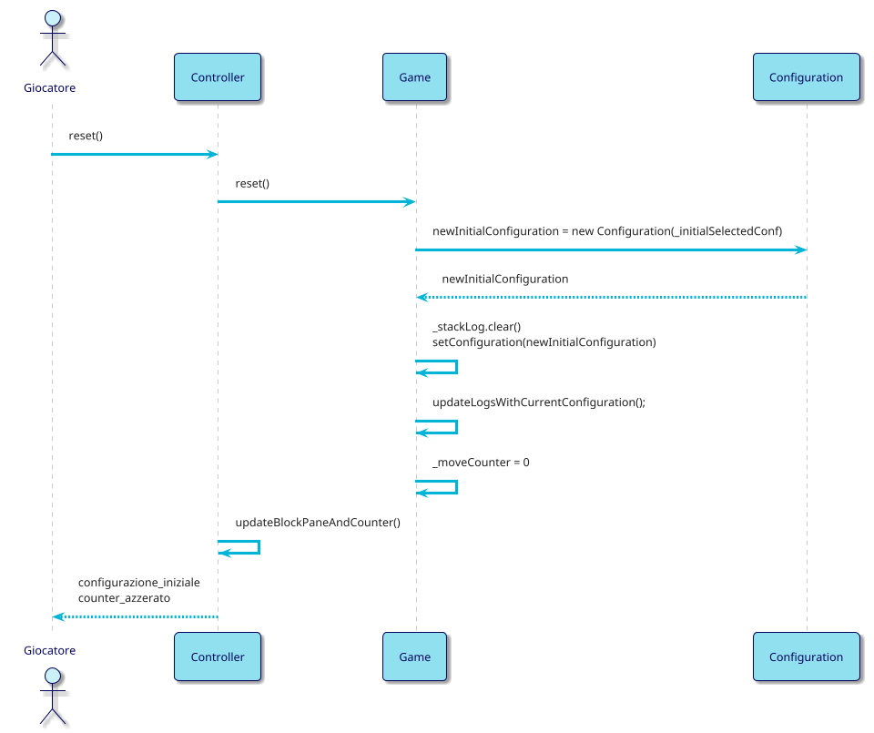

## richiedi_NBM()

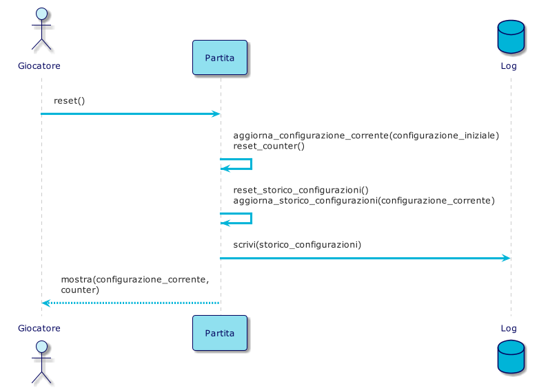

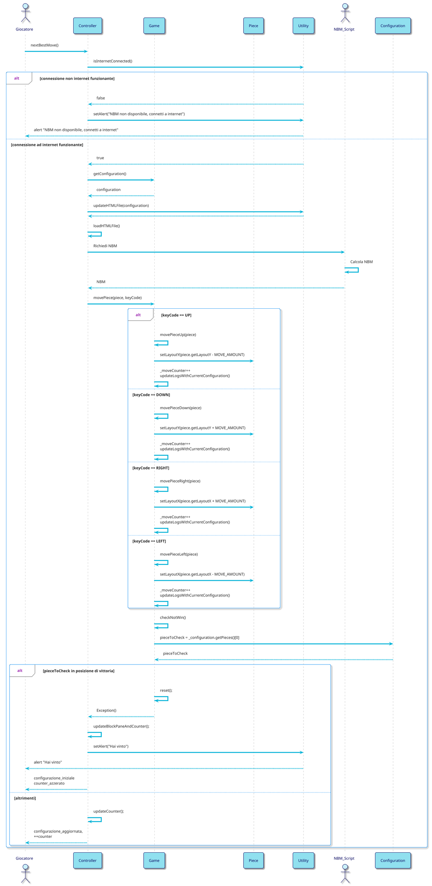
