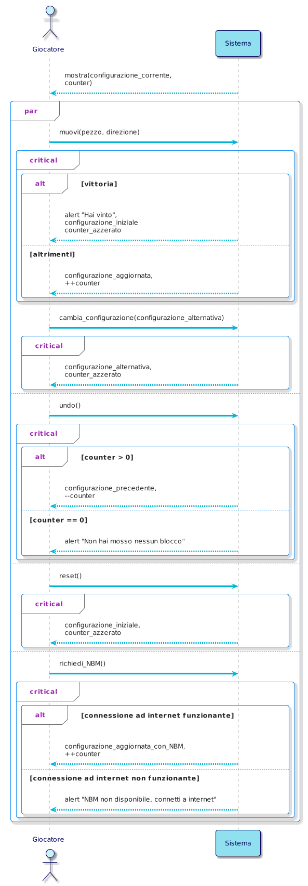
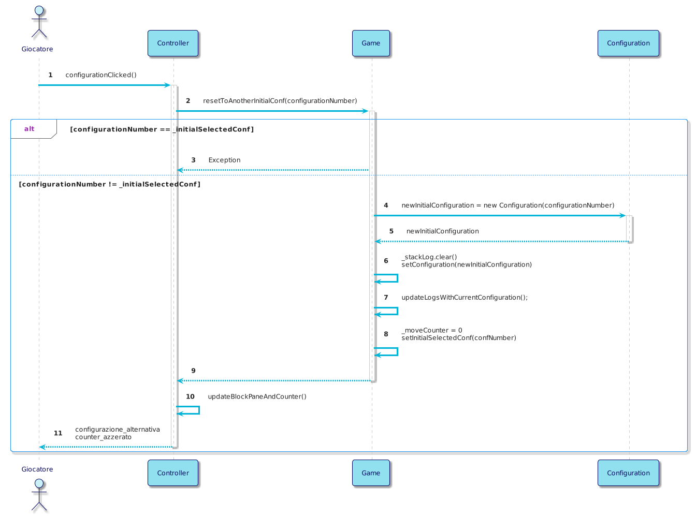
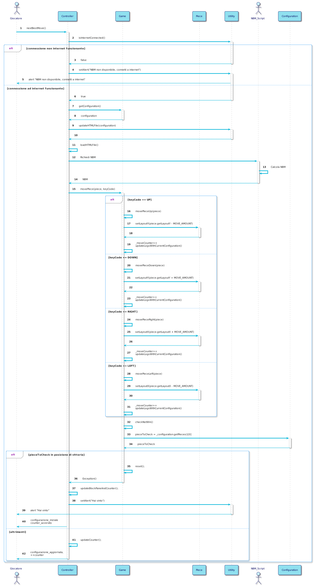

# System Sequence Diagram

# Internal Sequence Diagrams

## inizia_partita()

## muovi(blocco)

## cambia_configurazione(configurazione_alternativa)

## undo()

## reset()

## richiedi_NBM()

## Internal Sequence Diagram - Completo(da Eliminare)

