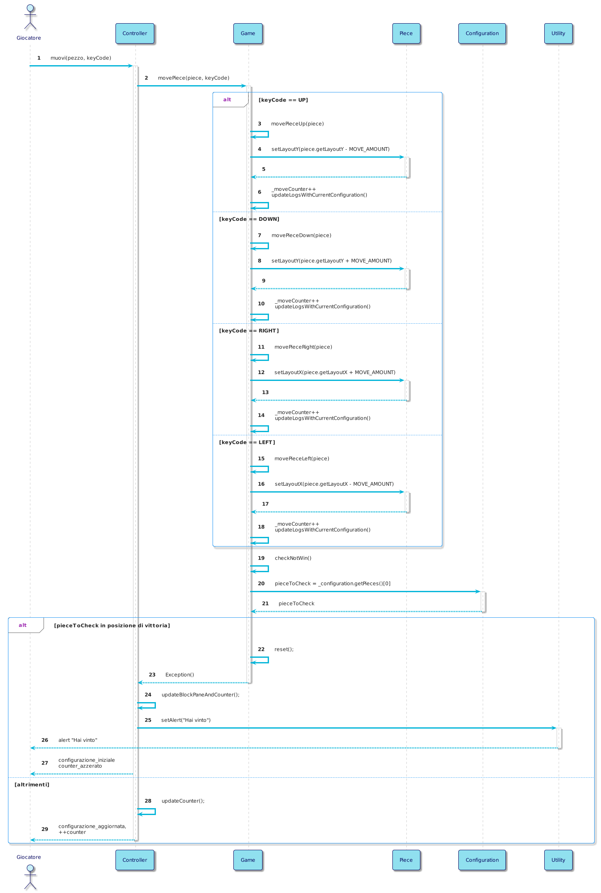

# System Sequence Diagram


```plantuml
!theme materia-outline

skinparam ArrowColor #00B4D8

actor Giocatore
participant Sistema

Giocatore -> Sistema: inizia_partita()
Sistema --> Giocatore: mostra(configurazione_corrente,\ncounter)

par
    Giocatore -> Sistema: muovi(blocco)
    
    critical 
      alt vittoria
        Sistema --> Giocatore: messaggio("hai vinto")

      else altrimenti
        Sistema --> Giocatore: mostra(configurazione_aggiornata,\ncounter++)
      end
    end
    
else 
    Giocatore -> Sistema: cambia_configurazione(configurazione_alternativa)
    
    critical 
      Sistema --> Giocatore: mostra(configurazione_alternativa,\ncounter_azzerato)
    end

else 
    Giocatore -> Sistema: undo()
    
    critical 
      alt counter > 0 
        Sistema --> Giocatore: mostra(configurazione_aggiornata,\ncounter--)
        
      else counter == 0
        Sistema --> Giocatore: messaggio("Impossibile tornare indietro")
      end
    end
    
else 
    Giocatore -> Sistema: reset()
    
    critical 
      Sistema --> Giocatore: mostra(configurazione_iniziale,\ncounter_azzerato)
    end

else 
    Giocatore -> Sistema: richiedi_NBM()
    
    critical 
      alt connessione ad internet
        Sistema --> Giocatore: mostra(NBM)
        
      else altrimenti
        Sistema --> Giocatore: messaggio("Next Best Move non disponibile")
    end
end
@enduml
```


# Internal Sequence Diagrams

## Internal Sequence Diagram: inizia_partita()




## Internal Sequence Diagram - Completo(da Eliminare)


