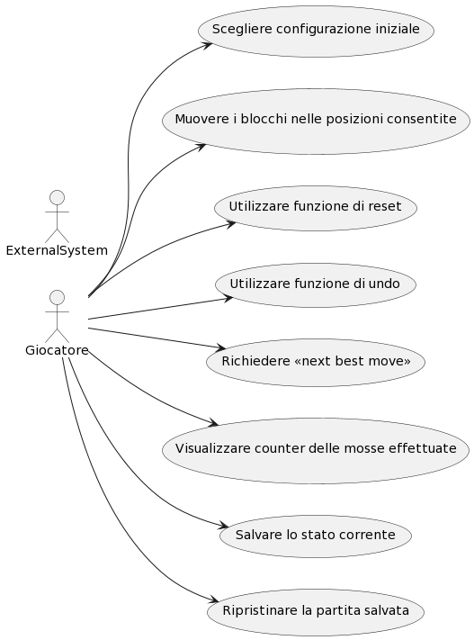
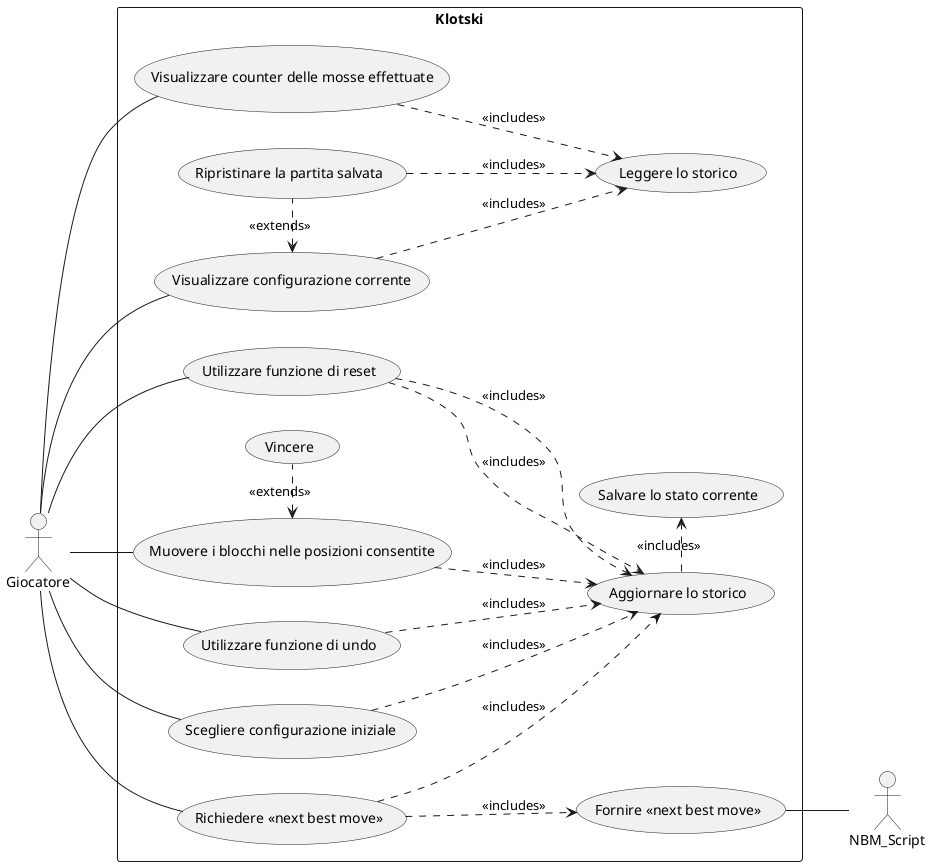

# Use Cases
1. Scegliere configurazione iniziale
2. Muovere i blocchi nelle posizioni consentite
3. Utilizzare funzione di reset
4. Utilizzare funzione di undo
5. Richiedere "next best move"
6. Visualizzare counter delle mosse effettuate
7. Salvare lo stato corrente
8. Ripristinare partita salvata

### Use Case 1
<table>
  <tr>
    <td><b>Nome dello Use Case</b>
    <td>Scegliere configurazione iniziale</td>
  </tr>
  <tr>
    <td><b>Attori</b></td>
    <td>Giocatore</td>
  </tr>
  <tr>
    <td><b>Descrizione</b></td>
    <td>Il giocatore può selezionare una tra quattro configurazioni iniziali per cominciare a giocare.</td>
  </tr>
  <tr>
    <td><b>Precondizioni</b></td>
    <td>-</td>
  </tr>
  <tr>
    <td><b>Scenario Principale</b></td>
    <td>Viene impostata dal programma la disposizione iniziale dei blocchi scelta dal giocatore.</td>
  </tr>
  <tr>
    <td><b>Scenario Alternativo</b></td>
    <td>La partita può iniziare o andare avanti con la configurazione fornita dal programma.</td>
  </tr>
  <tr>
    <td><b>Post-Condizioni</b></td>
    <td>Resettare il counter delle mosse e lo stato corrente.</td>
  </tr>
    <tr>
    <td><b>Note</b></td>
    <td>La scelta della configurazione iniziale può sempre essere attuata, ma lo stato dell'eventuale partita in corso precedentemente verrà eliminato.</td>
  </tr>
</table>

### Use Case 2
<table>
  <tr>
    <td><b>Nome dello Use Case</b>
    <td>Muovere i blocchi nelle posizioni consentite</td>
  </tr>
  <tr>
    <td><b>Attori</b></td>
    <td>Giocatore</td>
  </tr>
  <tr>
    <td><b>Descrizione</b></td>
    <td>Il giocatore può traslare un blocco per mossa negli spazi liberi che lo possono contenere.</td>
  </tr>
  <tr>
    <td><b>Precondizioni</b></td>
    <td>Deve esistere una posizione consentita, ossia uno spazio libero.</td>
  </tr>
  <tr>
    <td><b>Scenario Principale</b></td>
    <td>Il blocco selezionato viene spostato di una posizione nella direzione scelta dal giocatore.</td>
  </tr>
  <tr>
    <td><b>Scenario Alternativo</b></td>
    <td>Il blocco selezionato non si muove.</td>
  </tr>
  <tr>
    <td><b>Post-Condizioni</b></td>
    <td>Incrementare il counter delle mosse, aggiornare lo stato corrente.</td>
  </tr>
    <tr>
    <td><b>Note</b></td>
    <td>-</td>
  </tr>
</table>

### Use Case 3
<table>
  <tr>
    <td><b>Nome dello Use Case</b>
    <td>Visualizzare configurazione corrente</td>
  </tr>
  <tr>
    <td><b>Attori</b></td>
    <td>Giocatore</td>
  </tr>
  <tr>
    <td><b>Descrizione</b></td>
    <td>Il giocatore deve visualizzare a video la configurazione corrente.</td>
  </tr>
  <tr>
    <td><b>Precondizioni</b></td>
    <td>-</td>
  </tr>
  <tr>
    <td><b>Scenario Principale</b></td>
    <td>Viene mostrata al giocatore l'ultima configurazione presente nello storico.</td>
  </tr>
  <tr>
    <td><b>Scenario Alternativo</b></td>
    <td>-</td>
  </tr>
  <tr>
    <td><b>Post-Condizioni</b></td>
    <td>-</td>
  </tr>
    <tr>
    <td><b>Note</b></td>
    <td>-</td>
  </tr>
</table>

### Use Case 4
<table>
  <tr>
    <td><b>Nome dello Use Case</b>
    <td>Utilizzare funzione di reset</td>
  </tr>
  <tr>
    <td><b>Attori</b></td>
    <td>Giocatore</td>
  </tr>
  <tr>
    <td><b>Descrizione</b></td>
    <td>Il giocatore può resettare la partita attraverso un tasto dedicato.</td>
  </tr>
  <tr>
    <td><b>Precondizioni</b></td>
    <td>-</td>
  </tr>
  <tr>
    <td><b>Scenario Principale</b></td>
    <td>In qualsiasi momento il giocatore può decidere di resettare la partita premendo il tasto "reset". I blocchi devono essere sistemati nella configurazione iniziale relativa alla partita che stava giocando.</td>
  </tr>
  <tr>
    <td><b>Scenario Alternativo</b></td>
    <td>Se il giocatore non ha ancora effettuato alcuna mossa, il reset non fa nulla.</td>
  </tr>
  <tr>
    <td><b>Post-Condizioni</b></td>
    <td>Resettare il counter delle mosse, salvare lo stato corrente.</td>
  </tr>
    <tr>
    <td><b>Note</b></td>
    <td>-</td>
  </tr>
</table>

### Use Case 5
<table>
  <tr>
    <td><b>Nome dello Use Case</b>
    <td>Utilizzare funzione di undo</td>
  </tr>
  <tr>
    <td><b>Attori</b></td>
    <td>Giocatore</td>
  </tr>
  <tr>
    <td><b>Descrizione</b></td>
    <td>Il giocatore può scegliere di annullare una o più mosse, in ordine cronologico, dalla più recente alla meno recente, fino alla situazione di partenza</td>
  </tr>
  <tr>
    <td><b>Precondizioni</b></td>
    <td>Deve essere stata eseguita almeno una mossa</td>
  </tr>
  <tr>
    <td><b>Scenario Principale</b></td>
    <td>La disposizione dei blocchi ritorna allo stato precedente rispetto alla configurazione corrente.</td>
  </tr>
  <tr>
    <td><b>Scenario Alternativo</b></td>
    <td>Non viene applicata alcuna modifica allo stato di gioco, viene segnalato al giocatore che non ci sono mosse da annullare.</td>
  </tr>
  <tr>
    <td><b>Post-Condizioni</b></td>
    <td>Decrementare il counter delle mosse, salvare lo stato corrente.</td>
  </tr>
    <tr>
    <td><b>Note</b></td>
    <td>-</td>
  </tr>
</table>

### Use Case 6
<table>
  <tr>
    <td><b>Nome dello Use Case</b>
    <td>Richiedere "next best move"</td>
  </tr>
  <tr>
    <td><b>Attori</b></td>
    <td>Giocatore</td>
  </tr>
  <tr>
    <td><b>Descrizione</b></td>
    <td>Il giocatore visualizza una configurazione che rappresenta la mossa migliore rispetto alla configurazione precedente.</td>
  </tr>
  <tr>
    <td><b>Precondizioni</b></td>
    <td>La partita non deve essere finita, il giocatore deve essere connesso ad Internet.</td>
  </tr>
  <tr>
    <td><b>Scenario Principale</b></td>
    <td>Ogni volta che si richiede la NBM, un blocco alla volta verrà spostato in modo da ottenere la vittoria nel minor numero di mosse necessarie.</td>
  </tr>
  <tr>
    <td><b>Scenario Alternativo</b></td>
    <td>Viene visualizzato un messaggio "NBM non disponibile, connettiti ad internet" nel caso il giocatore non sia connesso.</td>
  </tr>
  <tr>
    <td><b>Scenario Alternativo</b></td>
    <td>Viene visualizzato un messaggio "Errore nel caricamento dell'NBM" nel caso sia andato storto qualcosa.</td>
  </tr>
   <tr>
    <td><b>Scenario Alternativo</b></td>
    <td>Viene visualizzato un messaggio "Caricamento dell'NBM in corso..." nel caso il giocatore stia richiedendo l'NBM di nuovo prima di averla ricevuta.
    </td>
  </tr>
  <tr>
    <td><b>Post-Condizioni</b></td>
    <td>Incrementare il counter delle mosse, salvare lo stato corrente.</td>
  </tr>
    <tr>
    <td><b>Note</b></td>
    <td>-</td>
  </tr>
</table>

### Use Case 7
<table>
  <tr>
    <td><b>Nome dello Use Case</b>
    <td>Visualizzare counter delle mosse effettuate</td>
  </tr>
  <tr>
    <td><b>Attori</b></td>
    <td>Giocatore</td>
  </tr>
  <tr>
    <td><b>Descrizione</b></td>
    <td>Il giocatore deve ruscire a visualizzare il counter delle mosse effettuate fino a quel momento.</td>
  </tr>
  <tr>
    <td><b>Precondizioni</b></td>
    <td>Deve essere disposto un counter nell'interfaccia grafica che mostra il numero di mosse svolte fino a quel
        momento.
    </td>
  </tr>
  <tr>
    <td><b>Scenario Principale</b></td>
    <td>Ogni volta che il giocatore fa una mossa qualcosa, il counter viene aggiornato e mostrato.</td>
  </tr>
  <tr>
    <td><b>Scenario Alternativo</b></td>
    <td>-</td>
  </tr>
  <tr>
    <td><b>Post-Condizioni</b></td>
    <td>-</td>
  </tr>
    <tr>
    <td><b>Note</b></td>
    <td>-</td>
  </tr>
</table>

### Use Case 8
<table>
  <tr>
    <td><b>Nome dello Use Case</b>
    <td>Salvare lo stato corrente</td>
  </tr>
  <tr>
    <td><b>Attori</b></td>
    <td>Klotski</td>
  </tr>
  <tr>
    <td><b>Descrizione</b></td>
    <td>Il gioco deve sempre salvare lo stato corrente.
    </td>
  </tr>
  <tr>
    <td><b>Precondizioni</b></td>
    <td>-</td>
  </tr>
  <tr>
    <td><b>Scenario Principale</b></td>
    <td>Ogni volta che il giocatore effettua un'azione che impatta sulla disposizione dei blocchi (mossa, undo, reset o scelta della configurazione iniziale), il gioco deve salvare automaticamente lo stato della partita, in modo che, se il programma dovesse essere chiuso, all'avvio successivo lo stato della partita possa essere ripristinato.</td>
  </tr>
  <tr>
    <td><b>Scenario Alternativo</b></td>
    <td>-</td>
  </tr>
  <tr>
    <td><b>Post-Condizioni</b></td>
    <td>-</td>
  </tr>
    <tr>
    <td><b>Note</b></td>
    <td>Lo stato corrente corrisponde a tutte le configurazioni generate fino a quel momento e, di conseguenza, il counter.</td>
  </tr>
</table>

### Use Case 9
<table>
  <tr>
    <td><b>Nome dello Use Case</b>
    <td>Ripristinare partita salvata</td>
  </tr>
  <tr>
    <td><b>Attori</b></td>
    <td>Giocatore</td>
  </tr>
  <tr>
    <td><b>Descrizione</b></td>
    <td>Quando il giocatore riapre l'applicazione, il gioco carica l'ultimo stato salvato.</td>
  </tr>
  <tr>
    <td><b>Precondizioni</b></td>
    <td>Deve essere presente un salvataggio di gioco, la partita caricata non deve essere già conclusa, il giocatore deve voler visualizzare l'utlima configurazione, avviando la partita.</td>
  </tr>
  <tr>
    <td><b>Scenario Principale</b></td>
    <td>Il giocatore apre l'applicazione e visualizza l'ultima configurazione salvata nello storico prima della chiusura del gioco.</td>
  </tr>
  <tr>
    <td><b>Scenario Alternativo</b></td>
    <td>-</td>
  </tr>
  <tr>
    <td><b>Post-Condizioni</b></td>
    <td>-</td>
  </tr>
    <tr>
    <td><b>Note</b></td>
    <td>-</td>
  </tr>
</table>

### Use Case 10
<table>
  <tr>
    <td><b>Nome dello Use Case</b>
    <td>Fornire "next best move"</td>
  </tr>
  <tr>
    <td><b>Attori</b></td>
    <td>NBM_Script</td>
  </tr>
  <tr>
    <td><b>Descrizione</b></td>
    <td>Il sistema esterno NBM_Script calcola l'NBM.</td>
  </tr>
  <tr>
    <td><b>Precondizioni</b></td>
    <td>Il giocatore deve essere connesso ad internet.</td>
  </tr>
  <tr>
    <td><b>Scenario Principale</b></td>
    <td>Il sistema esterno calcola l'NBM e la fornisce.</td>
  </tr>
  <tr>
    <td><b>Scenario Alternativo</b></td>
    <td>Il sistema esterno non riesce a calcolare l'NBM per qualche motivo.</td>
  </tr>
  <tr>
    <td><b>Scenario Alternativo</b></td>
    <td>Il sistema esterno non riceve la richiesta o non riesce ad inviare una rosposta a causa dell'interruzione della connessione.</td>
  </tr>
  <tr>
    <td><b>Post-Condizioni</b></td>
    <td>L'NBM deve esssere elaborata.</td>
  </tr>
    <tr>
    <td><b>Note</b></td>
    <td>-</td>
  </tr>
</table>

### Use Case 11
<table>
  <tr>
    <td><b>Nome dello Use Case</b>
    <td>Aggiornare lo storico</td>
  </tr>
  <tr>
    <td><b>Attori</b></td>
    <td>Klotski</td>
  </tr>
  <tr>
    <td><b>Descrizione</b></td>
    <td>Il sistema aggiorna lo storico, e lo memorizza su un supporto.</td>
  </tr>
  <tr>
    <td><b>Precondizioni</b></td>
    <td>Il supporto sulla quale viene memorizzato lo storico deve essere presente.</td>
  </tr>
  <tr>
    <td><b>Scenario Principale</b></td>
    <td>Il sistema esterno scrive lo storico sul supporto.</td>
  </tr>
  <tr>
    <td><b>Scenario Alternativo</b></td>
    <td>Se il supporto non c'è, deve crearlo e poi scriverci al suo interno.</td>
  </tr>
    <td><b>Post-Condizioni</b></td>
    <td>Il supporto deve essere chiuso, per evitare inconsistenze.</td>
  </tr>
    <tr>
    <td><b>Note</b></td>
    <td>-</td>
  </tr>
</table>

### Use Case 12
<table>
  <tr>
    <td><b>Nome dello Use Case</b>
    <td>Leggere lo storico</td>
  </tr>
  <tr>
    <td><b>Attori</b></td>
    <td>Klotski</td>
  </tr>
  <tr>
    <td><b>Descrizione</b></td>
    <td>Il sistema legge il supporto, prelevando informa</td>
  </tr>
  <tr>
    <td><b>Precondizioni</b></td>
    <td>Il supporto sulla quale viene memorizzato lo storico deve essere presente.</td>
  </tr>
  <tr>
    <td><b>Scenario Principale</b></td>
    <td>Il sistema esterno scrive lo storico sul supporto.</td>
  </tr>
  <tr>
    <td><b>Scenario Alternativo</b></td>
    <td>Se il supporto non c'è, deve crearlo e poi scriverci al suo interno.</td>
  </tr>
    <td><b>Post-Condizioni</b></td>
    <td>Il supporto deve essere chiuso, per evitare inconsistenze.</td>
  </tr>
    <tr>
    <td><b>Note</b></td>
    <td>-</td>
  </tr>
</table>

### Use Case 14
<table>
  <tr>
    <td><b>Nome dello Use Case</b>
    <td>Vincere</td>
  </tr>
  <tr>
    <td><b>Attori</b></td>
    <td>Giocatore</td>
  </tr>
  <tr>
    <td><b>Descrizione</b></td>
    <td>Il giocatore vince la partita.</td>
  </tr>
  <tr>
    <td><b>Precondizioni</b></td>
    <td>Il giocatore deve aver mosso un blocco in una posizione consentita.</td>
  </tr>
  <tr>
    <td><b>Scenario Principale</b></td>
    <td>Il giocatore sposta il blocco speciale nella posizione che determina la posizione di vittoria.</td>
  </tr>
  <tr>
    <td><b>Scenario Alternativo</b></td>
    <td>Il giocatore non vince perché non ha ancora spostato il blocco speciale nella posizione che determina la posizione di vittoria.</td>
  </tr>
    <td><b>Post-Condizioni</b></td>
    <td>L</td>
  </tr>
    <tr>
    <td><b>Note</b></td>
    <td>-</td>
  </tr>
</table>

# Grafo Use Cases

