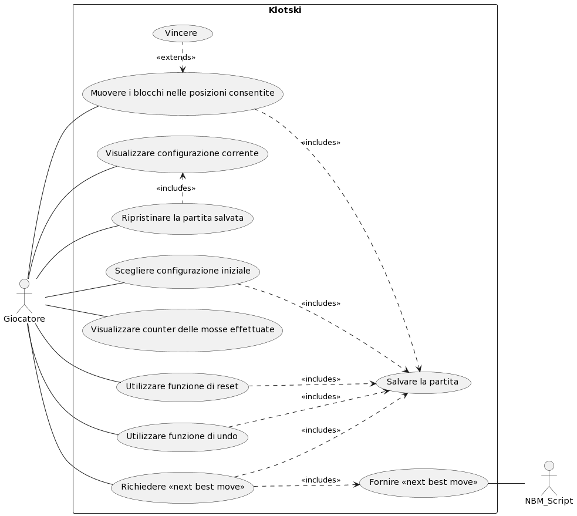

# Use Cases
1. Visualizzare configurazione corrente
2. Scegliere configurazione iniziale
3. Muovere i pezzi nelle posizioni consentite
4. Visualizzare counter delle mosse effettuate
5. Utilizzare funzione di reset
6. Utilizzare funzione di undo
7. Visualizzare "next best move"
8. Salvare la partita
9. Ripristinare partita salvata
10. Fornire "next best move"
11. Vincere

### Use Case 1
<table>
  <tr>
    <td><b>Nome dello Use Case</b>
    <td>Visualizzare configurazione corrente</td>
  </tr>
  <tr>
    <td><b>Attori</b></td>
    <td>Giocatore</td>
  </tr>
  <tr>
    <td><b>Descrizione</b></td>
    <td>Il giocatore deve visualizzare a video la configurazione corrente.</td>
  </tr>
  <tr>
    <td><b>Precondizioni</b></td>
    <td>-</td>
  </tr>
  <tr>
    <td><b>Scenario Principale</b></td>
    <td>Viene mostrata al giocatore l'ultima configurazione presente nello storico.</td>
  </tr>
  <tr>
    <td><b>Scenario Alternativo</b></td>
    <td>-</td>
  </tr>
  <tr>
    <td><b>Post-Condizioni</b></td>
    <td>-</td>
  </tr>
    <tr>
    <td><b>Note</b></td>
    <td>-</td>
  </tr>
</table>

### Use Case 2
<table>
  <tr>
    <td><b>Nome dello Use Case</b>
    <td>Scegliere configurazione iniziale</td>
  </tr>
  <tr>
    <td><b>Attori</b></td>
    <td>Giocatore</td>
  </tr>
  <tr>
    <td><b>Descrizione</b></td>
    <td>Il giocatore può selezionare una tra quattro configurazioni iniziali per cominciare a giocare.</td>
  </tr>
  <tr>
    <td><b>Precondizioni</b></td>
    <td>-</td>
  </tr>
  <tr>
    <td><b>Scenario Principale</b></td>
    <td>Viene impostata dal programma la disposizione iniziale dei pezzi in base alla configurazione iniziale scelta dal giocatore.</td>
  </tr>
  <tr>
    <td><b>Scenario Alternativo</b></td>
    <td>La partita può iniziare o andare avanti con la configurazione corrente.</td>
  </tr>
  <tr>
    <td><b>Post-Condizioni</b></td>
    <td>Resettare il counter delle mosse e la partita.</td>
  </tr>
    <tr>
    <td><b>Note</b></td>
    <td>La scelta della configurazione iniziale può sempre essere attuata, ma la partita in corso verrà eliminata.</td>
  </tr>
</table>

### Use Case 3
<table>
  <tr>
    <td><b>Nome dello Use Case</b>
    <td>Muovere i pezzi nelle posizioni consentite</td>
  </tr>
  <tr>
    <td><b>Attori</b></td>
    <td>Giocatore</td>
  </tr>
  <tr>
    <td><b>Descrizione</b></td>
    <td>Il giocatore può traslare un pezzo per mossa negli spazi liberi che lo possono contenere.</td>
  </tr>
  <tr>
    <td><b>Precondizioni</b></td>
    <td>Deve esistere una posizione consentita, ossia uno spazio libero.</td>
  </tr>
  <tr>
    <td><b>Scenario Principale</b></td>
    <td>Il pezzo selezionato viene spostato di una posizione nella direzione scelta dal giocatore.</td>
  </tr>
  <tr>
    <td><b>Scenario Alternativo</b></td>
    <td>Il pezzo selezionato non si muove.</td>
  </tr>
  <tr>
    <td><b>Post-Condizioni</b></td>
    <td>Incrementare il counter delle mosse, salvare la partita.</td>
  </tr>
    <tr>
    <td><b>Note</b></td>
    <td>-</td>
  </tr>
</table>

### Use Case 4
<table>
  <tr>
    <td><b>Nome dello Use Case</b>
    <td>Visualizzare counter delle mosse effettuate</td>
  </tr>
  <tr>
    <td><b>Attori</b></td>
    <td>Giocatore</td>
  </tr>
  <tr>
    <td><b>Descrizione</b></td>
    <td>Il giocatore deve riuscire a visualizzare il counter delle mosse effettuate fino a quel momento.</td>
  </tr>
  <tr>
    <td><b>Precondizioni</b></td>
    <td>Deve essere disposto un counter nell'interfaccia grafica che mostra il numero di mosse svolte fino a quel
        momento.
    </td>
  </tr>
  <tr>
    <td><b>Scenario Principale</b></td>
    <td>Ogni volta che il giocatore fa qualcosa, il counter viene aggiornato e visualizzato dal giocatore stesso.</td>
  </tr>
  <tr>
    <td><b>Scenario Alternativo</b></td>
    <td>-</td>
  </tr>
  <tr>
    <td><b>Post-Condizioni</b></td>
    <td>-</td>
  </tr>
    <tr>
    <td><b>Note</b></td>
    <td>-</td>
  </tr>
</table>

### Use Case 5
<table>
  <tr>
    <td><b>Nome dello Use Case</b>
    <td>Utilizzare funzione di reset</td>
  </tr>
  <tr>
    <td><b>Attori</b></td>
    <td>Giocatore</td>
  </tr>
  <tr>
    <td><b>Descrizione</b></td>
    <td>Il giocatore può resettare la partita attraverso un tasto dedicato.</td>
  </tr>
  <tr>
    <td><b>Precondizioni</b></td>
    <td>-</td>
  </tr>
  <tr>
    <td><b>Scenario Principale</b></td>
    <td>In qualsiasi momento il giocatore può decidere di resettare la partita premendo il tasto "reset". I pezzi devono essere sistemati nella configurazione iniziale relativa alla partita che stava giocando.</td>
  </tr>
  <tr>
    <td><b>Scenario Alternativo</b></td>
    <td>Se il giocatore non ha ancora effettuato una mossa, il reset non fa nulla.</td>
  </tr>
  <tr>
    <td><b>Post-Condizioni</b></td>
    <td>Resettare il counter delle mosse e la partita.</td>
  </tr>
    <tr>
    <td><b>Note</b></td>
    <td>-</td>
  </tr>
</table>

### Use Case 6
<table>
  <tr>
    <td><b>Nome dello Use Case</b>
    <td>Utilizzare funzione di undo</td>
  </tr>
  <tr>
    <td><b>Attori</b></td>
    <td>Giocatore</td>
  </tr>
  <tr>
    <td><b>Descrizione</b></td>
    <td>Il giocatore può scegliere di annullare una mossa attraverso il tasto dedicato.</td>
  </tr>
  <tr>
    <td><b>Precondizioni</b></td>
    <td>Deve essere stata eseguita almeno una mossa prima di richiamare la funzionalità.</td>
  </tr>
  <tr>
    <td><b>Scenario Principale</b></td>
    <td>La disposizione dei pezzi ritorna alla configurazione precedente rispetto a quella corrente.</td>
  </tr>
  <tr>
    <td><b>Scenario Alternativo</b></td>
    <td>Non viene applicata alcuna modifica allo stato di gioco, viene segnalato al giocatore che non ci sono mosse da annullare.</td>
  </tr>
  <tr>
    <td><b>Post-Condizioni</b></td>
    <td>Decrementare il counter delle mosse, salvare la partita.</td>
  </tr>
    <tr>
    <td><b>Note</b></td>
    <td>Il giocatore può annullare quante mosse vuole, tornando indietro nello storico della partita, fino alla configurazione iniziale.</td>
  </tr>
</table>

### Use Case 7
<table>
  <tr>
    <td><b>Nome dello Use Case</b>
    <td>Visualizzare "next best move"</td>
  </tr>
  <tr>
    <td><b>Attori</b></td>
    <td>Giocatore</td>
  </tr>
  <tr>
    <td><b>Descrizione</b></td>
    <td>Il giocatore visualizza una configurazione che rappresenta la mossa migliore rispetto alla configurazione precedente.</td>
  </tr>
  <tr>
    <td><b>Precondizioni</b></td>
    <td>Il giocatore deve essere connesso ad Internet.</td>
  </tr>
  <tr>
    <td><b>Scenario Principale</b></td>
    <td>Ogni volta che si richiede la NBM, un pezzo alla volta verrà spostato in modo da ottenere la vittoria nel minor numero di mosse necessarie.</td>
  </tr>
  <tr>
    <td><b>Scenario Alternativo</b></td>
    <td>Viene visualizzato un messaggio "NBM non disponibile, connettiti ad Internet" nel caso il giocatore non sia connesso.</td>
  </tr>
  <tr>
    <td><b>Scenario Alternativo</b></td>
    <td>Viene visualizzato un messaggio "Errore nel caricamento della NBM" nel caso sia andato storto qualcosa.</td>
  </tr>
   <tr>
    <td><b>Scenario Alternativo</b></td>
    <td>Viene visualizzato un messaggio "Caricamento della NBM in corso..." nel caso il giocatore stia richiedendo la NBM di nuovo prima di averla ricevuta.
    </td>
  </tr>
  <tr>
    <td><b>Post-Condizioni</b></td>
    <td>Incrementare il counter delle mosse, salvare la partita.</td>
  </tr>
    <tr>
    <td><b>Note</b></td>
    <td>-</td>
  </tr>
</table>

### Use Case 8
<table>
  <tr>
    <td><b>Nome dello Use Case</b>
    <td>Salvare la partita</td>
  </tr>
  <tr>
    <td><b>Attori</b></td>
    <td>Giocatore</td>
  </tr>
  <tr>
    <td><b>Descrizione</b></td>
    <td>Il giocatore deve poter salvare la partita.
    </td>
  </tr>
  <tr>
    <td><b>Precondizioni</b></td>
    <td>Il giocatore ha fatto qualcosa.</td>
  </tr>
  <tr>
    <td><b>Scenario Principale</b></td>
    <td>Ogni volta che il giocatore effettua un'azione che impatta sulla disposizione dei pezzi (mossa, undo, reset o scelta della configurazione iniziale), la partita deve essere salvata in modo che, se il programma dovesse essere chiuso, all'avvio successivo, la partita possa essere ripristinata.</td>
  </tr>
  <tr>
    <td><b>Scenario Alternativo</b></td>
    <td>-</td>
  </tr>
  <tr>
    <td><b>Post-Condizioni</b></td>
    <td>-</td>
  </tr>
    <tr>
    <td><b>Note</b></td>
    <td>La partita è rappresentata da tutte le configurazioni generate fino a quel momento (più la configurazione iniziale) e, di conseguenza, dal counter delle mosse.</td>
  </tr>
</table>

### Use Case 9
<table>
  <tr>
    <td><b>Nome dello Use Case</b>
    <td>Ripristinare partita salvata</td>
  </tr>
  <tr>
    <td><b>Attori</b></td>
    <td>Giocatore</td>
  </tr>
  <tr>
    <td><b>Descrizione</b></td>
    <td>Quando il giocatore riapre l'applicazione, il gioco carica l'ultima configurazione salvata.</td>
  </tr>
  <tr>
    <td><b>Precondizioni</b></td>
    <td>Deve essere presente un salvataggio di gioco, la partita caricata non deve essere già conclusa, il giocatore deve voler visualizzare l'ultima configurazione, avviando la partita.</td>
  </tr>
  <tr>
    <td><b>Scenario Principale</b></td>
    <td>Il giocatore apre l'applicazione e visualizza l'ultima configurazione salvata alla chiusura del gioco.</td>
  </tr>
  <tr>
    <td><b>Scenario Alternativo</b></td>
    <td>-</td>
  </tr>
  <tr>
    <td><b>Post-Condizioni</b></td>
    <td>-</td>
  </tr>
    <tr>
    <td><b>Note</b></td>
    <td>-</td>
  </tr>
</table>

### Use Case 10
<table>
  <tr>
    <td><b>Nome dello Use Case</b>
    <td>Fornire "next best move"</td>
  </tr>
  <tr>
    <td><b>Attori</b></td>
    <td>NBM_Script</td>
  </tr>
  <tr>
    <td><b>Descrizione</b></td>
    <td>Il sistema esterno NBM_Script calcola la NBM.</td>
  </tr>
  <tr>
    <td><b>Precondizioni</b></td>
    <td>Il giocatore deve essere connesso ad Internet.</td>
  </tr>
  <tr>
    <td><b>Scenario Principale</b></td>
    <td>Il sistema esterno calcola la NBM e la fornisce.</td>
  </tr>
  <tr>
    <td><b>Scenario Alternativo</b></td>
    <td>Il sistema esterno non riesce a calcolare la NBM per qualche motivo.</td>
  </tr>
  <tr>
    <td><b>Scenario Alternativo</b></td>
    <td>Il sistema esterno non riceve la richiesta o non riesce ad inviare una risposta a causa dell'interruzione della connessione.</td>
  </tr>
  <tr>
    <td><b>Post-Condizioni</b></td>
    <td>L'NBM deve essere elaborata e mostrata.</td>
  </tr>
    <tr>
    <td><b>Note</b></td>
    <td>-</td>
  </tr>
</table>

### Use Case 11
<table>
  <tr>
    <td><b>Nome dello Use Case</b>
    <td>Vincere</td>
  </tr>
  <tr>
    <td><b>Attori</b></td>
    <td>Giocatore</td>
  </tr>
  <tr>
    <td><b>Descrizione</b></td>
    <td>Il giocatore deve poter vincere.</td>
  </tr>
  <tr>
    <td><b>Precondizioni</b></td>
    <td>Il giocatore deve aver mosso il pezzo speciale nella posizione di vittoria (in basso in centro).</td>
  </tr>
  <tr>
    <td><b>Scenario Principale</b></td>
    <td>Al giocatore viene segnalato che ha vinto.</td>
  </tr>
  <tr>
    <td><b>Scenario Alternativo</b></td>
    <td>Il giocatore, con la mossa corrente, non ha raggiunto la posizione di vittoria col pezzo speciale.</td>
  </tr>
  <tr>
    <td><b>Post-Condizioni</b></td>
    <td>Il counter delle mosse viene azzerato, la partita viene resettata.</td>
  </tr>
    <tr>
    <td><b>Note</b></td>
    <td>-</td>
  </tr>
</table>

# Grafo Use Cases

